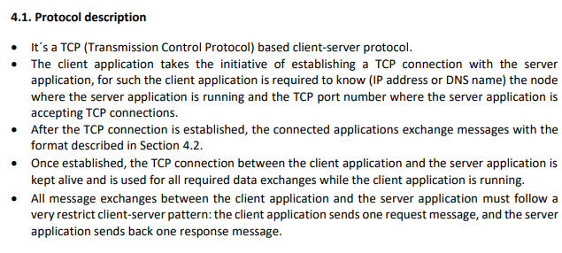
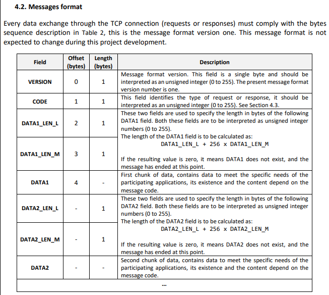

### Sprint master: 1220780 ###

# 1. Sprint's backlog #

- **US1016** - As Customer Manager, I want the system to notify candidates, by email, of the result of the verification
  process.

- **1020** - As Customer Manager, I want to publish the results of the selection of candidates for a job opening, so
  that candidates and customer are notified by email of the result.

- **3000** - As Candidate, I want to list all my applications and their state(including the number of applicants).

- **3001** - As Candidate, I want to be notified in my application when the state of one of my applications changes.

- **3002** -As Customer, I want to list all my job openings, including job reference, position, active since, number of
  applicants.

- **3003** - As Customer, I want to be notified in my application when the state (phase) of my job openings changes.

# 2. Technical decisions and coordination #

## How to run User Stories ##

Assuming the user has a stable internet connection with the DEI server, the user firstly
runs the FollowUp Server App, and then runs one of three options:
* The CustomerApp (3002, 3003)
* The CandidateApp (3000, 3001)
* BackOfficeApp (1020 - Must be logged as Customer Manager) 

## Protocol description and Messages format ##

All USs followed the protocol and message format referred in "RCOMP Project" file available in the moodle.

## Message codes ##

| CODE |   TYPE   |                                                                                                                                              MEANING                                                                                                                                              |
|:----:|:--------:|:-------------------------------------------------------------------------------------------------------------------------------------------------------------------------------------------------------------------------------------------------------------------------------------------------:|
|  0   | Request  |                                                                      COMMTEST – Communications test request with no other effect on the server application than the response with an ACK message. This request has no data.                                                                       |
|  1   | Request  |                                 DISCONN – End of session request. The server application is supposed to respond with an ACK message, afterwards both client and server applications are expected to close the session (TCP connection). This request has no data.                                 |
|  2   | Response |                                                                                ACK – Generic acknowledgment and success response message. Used in response toa successful request. This response contains no data.                                                                                |
|  3   | Response | ERR – Error response message. Used in response to unsuccessful requests that caused an error. This response message may carry a human readable phrase explaining the error. If used, the phrase is carried in the DATA1 field as string of ASICII codes, it’s not required to be null terminated. |
|  4   | Request  |         AUTH – User authentication request carrying the username in DATA1 and the user’spassword in DATA2, both are strings of ASICII codes and are not required to be null terminated. If the authentication is successful, the server application response is ACK, otherwise it’s ERR.          |
|  5   | Request  |                                                                                                                                           US_3000 - ...                                                                                                                                           |
|  6   | Request  |  US_3001 - List Candidate Notifications regarding applications state change. Carries in DATA 1 the users username. If Successfull the Server Application response is in DATA 1 a serialized list of NotificationDTOs and an ACK response to notify it was completed. Otherwise it will be an ERR  |
|  7   | Request  |                     US_3002 - List Customer Job Openings. Carries in DATA 1 the users username. If Successfull the Server Application response is in DATA 1 a serialized list of JobOpeningDTOs and an ACK response to notify it was completed. Otherwise it will be an ERR.                      |
|  8   | Request  |  US_3003 - List Customer Notifications regarding Job Openings phase change. Carries in DATA 1 the users username. If Successfull the Server Application response is in DATA 1 a serialized list of NotificationDTOs and an ACK response to notify it was completed. Otherwise it will be an ERR.  |

## 3. Subtasks assignment ##

- 1220780 - **US1016** - As Customer Manager, I want the system to notify candidates, by email, of the result of the
  verification
  process.

- 1221003 - **3002** -As Customer, I want to list all my job openings, including job reference, position, active since,
  number of
  applicants.
  **3003** - As Customer, I want to be notified in my application when the state (phase) of my job openings
  changes.

- 1221219 - **1020** - As Customer Manager, I want to publish the results of the selection of candidates for a job
  opening, so
  that candidates and customer are notified by email of the result.

- 1201718 - **3000** - As Candidate, I want to list all my applications and their state(including the number of
  applicants).

- 1221023 - **3001** - As Candidate, I want to be notified in my application when the state of one of my applications
  changes.

