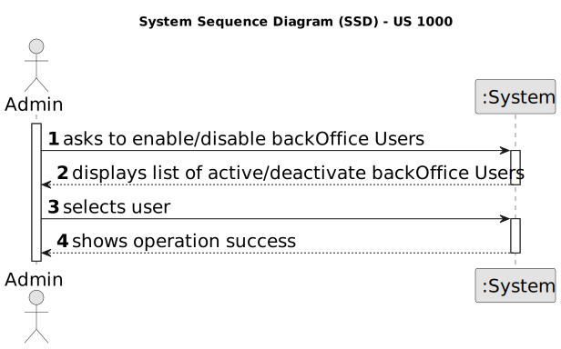
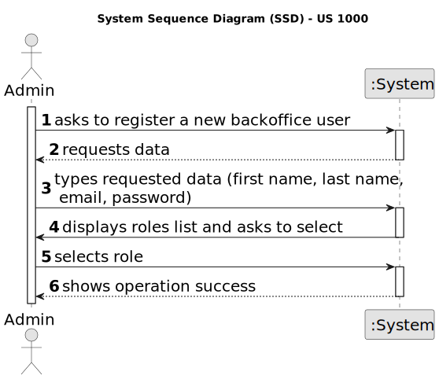
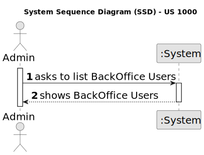
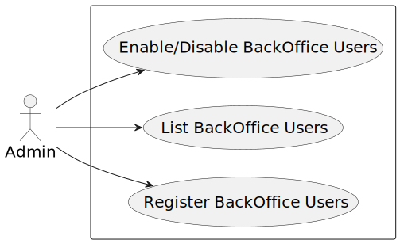
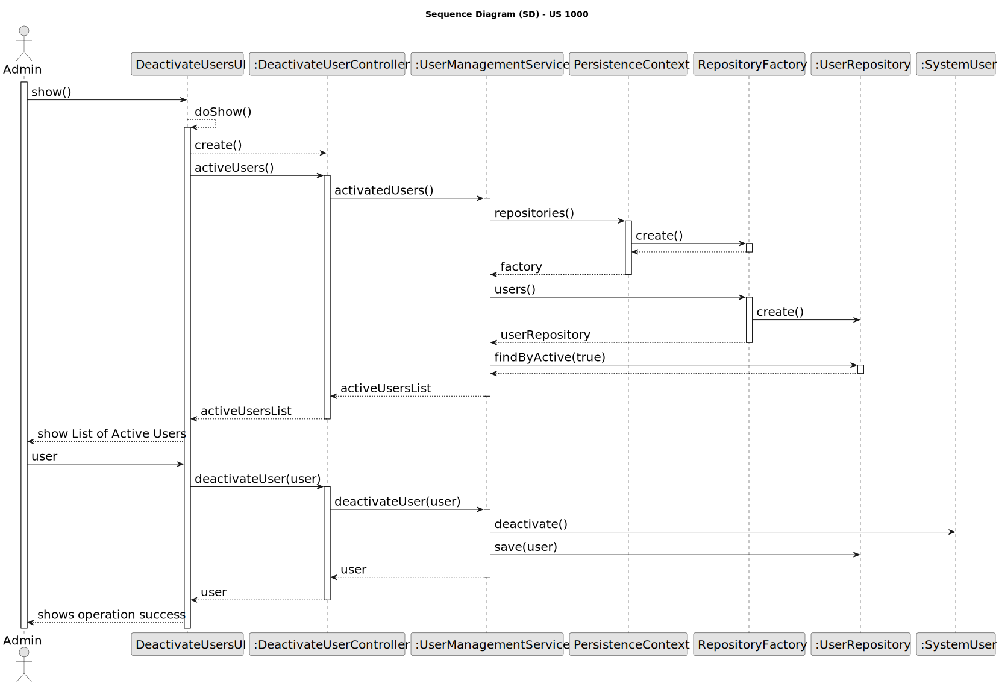
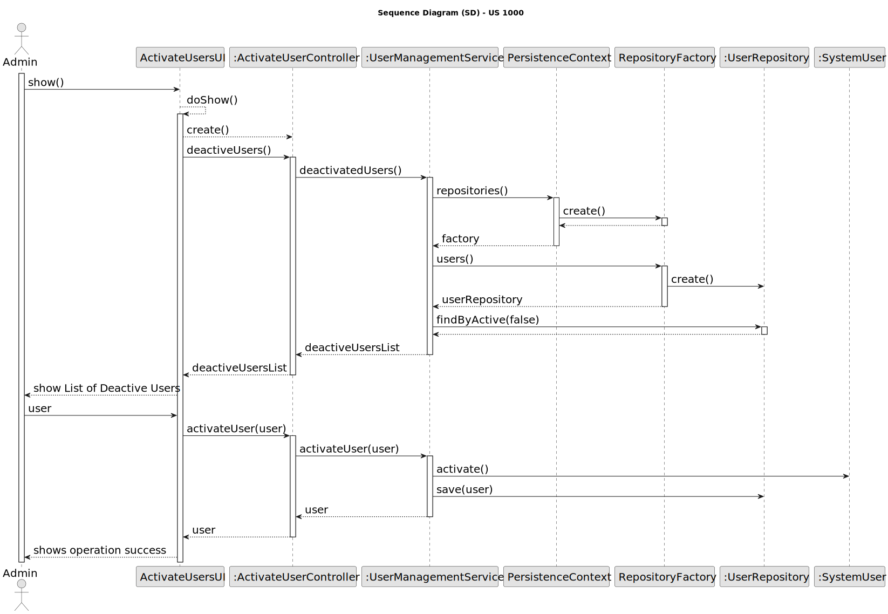
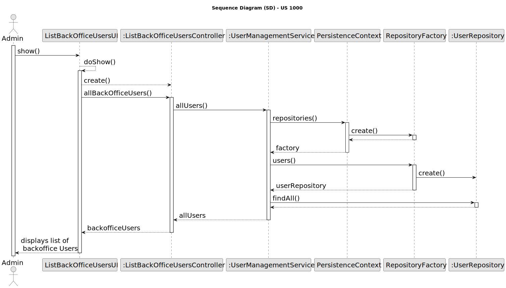
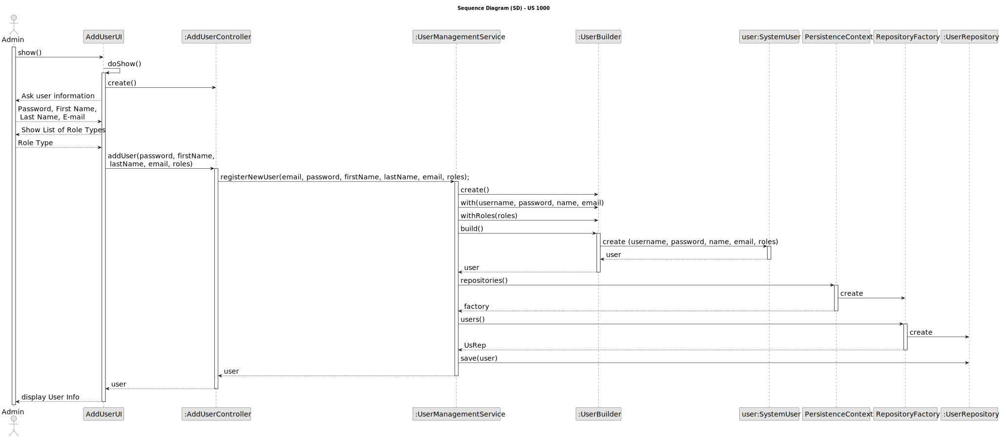
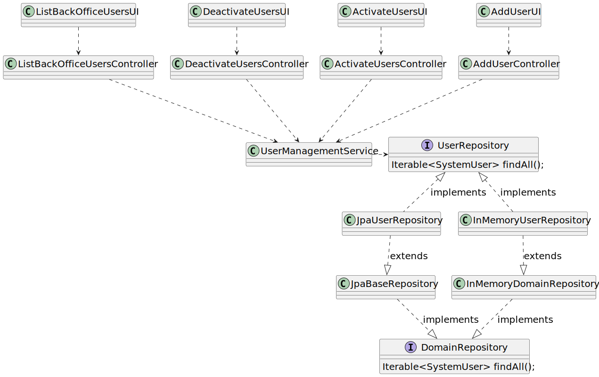

# US 1000

## 1. Context

*This task is being taken for the first time in Sprint B.*

## 2. Requirements

**US 1000** As Administrator, I want to be able to register, disable/enable, and list users of the backoffice.

**Client Acceptance Criteria:**

* Q10: O Admin é responsável por gerir apenas Customer managers ou outros, como por exemplo Operators? E qual o
  significado dessa responsabilidade?

* A10: A ideia é que o Admin fará a gestão desses utilizadores (e no limite também dos Operators). Na prática, as US que
  remetem para essas funcionalidades, podem ser “substituidas” por um processo de “bootstrap” que faça inicializações na
  base de dados para suportar esses utilizadores/papeis (tal como mencionado no texto das US)


* Q57: Quais às politicas de negócio para registar um candidato, quais as caracteristicas da password, email,
  telemóvel?

* A57: Sobre o telemóvel, seguir o Q56. Sobre email, seria qualquer email válido. Sobre a password, podemos seguir algo
  como: ter no mínimo 8 caracteres, letras maiúsculas e minúsculas, dígitos e pelo menos, um caracter não alfanumérico.


* Q72: Multiple enable/disable (US1000) – Can a user (from the backoffice, for example) be enabled/disabled
  multiple times?

* A72: Yes


* Q80: US1000 – Information about the users - Based on the user story description: "As Administrator, I want to be
  able to register, disable/enable, and list users of the backoffice.", I have the following questions: 1 - Can there be
  more than one administrator of the backoffice? 2 - What information about the backoffice users need to be registered?

* A80: Regarding question 1, one admin is enough. Regarding question 2, see Q11.

**Dependencies/References:**

- In the project description it was mentioned as a reference that this user story can be achieved by using a bootstrap
  process.

## 3. Analysis






## 4. Design

In order to implement this US it was divided into 4 parts:
-Enable Users;
-Disable Users;
-List Users;
-Register Users;

For all these parts, options were created for the Admin to select in order to access the functionalities and the code
responsible for the major operations was reused/modified from the EAPLI base project.
Such changes is for example the modification of the password policy to be on par with the client criteria.

### 4.1. Sequence Diagram






### 4.2. Class Diagram



### 4.3. Tests

**Refers to Client Acceptance Criteria:** A57

```
    private final PasswordPolicy policy = new UserPasswordPolicy();

    @Test
    public void ensurePasswordIsNotNull() throws Exception {
        assertFalse(policy.isSatisfiedBy(null));
    }

    @Test
    public void ensurePasswordIsNotEmpty() throws Exception {
        assertFalse(policy.isSatisfiedBy(""));
    }

    @Test
    public void ensurePasswordIsNotWhiteSpaces() throws Exception {
        assertFalse(policy.isSatisfiedBy("   "));
    }

    @Test
    public void ensurePasswordIsNotValid() throws Exception {
        assertFalse(policy.isSatisfiedBy("Password1"));
        assertFalse(policy.isSatisfiedBy("Password+"));
        assertFalse(policy.isSatisfiedBy("password1+"));
        assertFalse(policy.isSatisfiedBy("Pa1+"));
    }

    @Test
    public void ensurePasswordIsValid() throws Exception {
        assertTrue(policy.isSatisfiedBy("Password1+"));
        }
````
