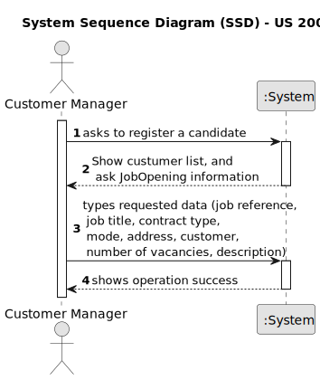

# US 1002

## 1. Context

*This task is being taken for the first time in Sprint B.*

## 2. Requirements

**US 1002** As Customer Manager, I want to register a job opening.

**Client Acceptance Criteria:**

* Q7 Rita – No contexto em que o Customer Manager regista uma oferta de emprego, como são selecionados/definidos os requisitos para essa job offer?

* A7 O Customer manager regista a job opening (US 1002) e de seguida (normalmente) seleciona qual o requirements specification que é adequado a esse job opening. O requirements specification será um dos que foi “criado” pelo language engineer e registado no sistema.


* Q77 Simões – US1002 Critérios de Aceitação – Relativamente à US1002 - "As Customer Manager, I want to register a job opening", existe algum critério de aceitação ainda não mencionado, relacionado com os atributos? Ou fica ao critério da equipa de desenvolvimento consoante boas práticas e senso comum? Alguns exemplos: - O "Number of Vacancies" não poder ser menor ou igual a 0 ou pode ser opcional; - A "Description" ter um tamanho de caracteres limite ou ser opcional;

* A77. Sobre se existem critérios de aceitação não mencionados não me vou pronunciar, faz parte do processo descobrirem. Eu sugeria usarem algo mais que o senso comum


* Q88 Cardoso – US1002 – Quando o Customer Manager regista uma job offer, é ele que cria as requirement specifications e as interview models ou é-lhe dada uma lista destes para ele selecionar?

* A88. Existe a US1002 e as US1009 e US1011. Penso que está claro qual a responsabilidade de cada uma. A criação dos modelos das entrevistas e dos requisitos é um caso de uso especifico e com um US especifica para registar no sistema os respectivos plugins (US1008).


* Q91 Varela – [1002, 1007, 1009] - Validez de uma Job Openings – A nossa questão principal seria: quando é que uma job opening é considerada válida? Tendo em conta as funcionalidades 1002, 1007, 1009, surgiu-nos uma duvida relativamente às job openings e à sua constituiçao. Na US1002, é suposto resgistar uma job opening e apenas depois, na US1009, devemos selecionar os requirements specifications para a dada job opening. Posto isto, aquando o registo da job opening, esta não iria possuir toda a informaçao obrigatória como requerido. Assim sendo, deveria haver uma ligação direta entre estas user stories de forma a que, aquando o registo, passamos automaticamente a selecionar os requirements obtendo assim uma job opening válida? Adicionalmente, queremos esclarecer se o recruitment process é algo obrigatório para a validez de um job opening.

* A91. O product owner não é especialista do dominio da solução (apenas têm conhecimentos do problema) mas, quanto à primeira questão, sugere que talvez user stories não sejam (podem não ser) opções de menu “distintas”. Quanto à segunda questão (recruitment process) julgo que também está mais ligada à solução que ao problema, pelo que não vou sugerir nada que possa até complicar mais do que esclarecer.


* Q114 Guedes – US1002 - Um customer manager tem a responsabilidade de criar job openings para os customers em que é responsável. Na hora da criação da job opening, como é que ele refere qual é o customer daquela job opening? Seleciona um customer dentro dos que está responsável?

* A114. Sim, pode ser como indica.


* Q115 Paula – US1002, 1007, 1009 - Na US1002 ao registar um job opening é imperativo selecionar também o job requirement e/ou as fases de recrutamento?

* A115. São US diferentes e, do meu ponto de vista, podem ser executadas em momentos diferentes. Apenas lembro que, como é evidente, desejo que o sistema esteja sempre num estado consistente.

## 3. Analysis



## 4. Design

### 4.1. Sequence Diagram


### 4.2. Tests

**Refers to Client Acceptance Criteria:** A91

```
    @Test
    public void testConstructorWithValidArguments() {
        JobReference jobReference = new JobReference("ISEP","123");
        Description description = Description.valueOf("Test description");
        Address address = new Address("123 Street", "City", "state");
        String jobOpeningMode = "Full-time";
        String jobTitle = "Software Engineer";
        String jobOpeningState = "Open";
        String contractType = "Permanent";
        Integer numberOfVacancies = 2;
        SystemUser manager = getNewCustomerUser();
        Customer customer = new CustomerBuilder().withCustomerCode("IGUAL").withSystemUser(getNewCustomerUser())
                .withAddress("street", "city", "state").withManager(getNewCustomerUser()).build();

        JobOpening jobOpening = new JobOpening(jobReference, description, address, jobOpeningMode, jobTitle, jobOpeningState,
                contractType, numberOfVacancies, manager, customer);

        assertNotNull(jobOpening);
    }

    @Test
    public void testConstructorWithNullArguments() {
        assertThrows(IllegalArgumentException.class, () -> {
            new JobOpening(null, null, null, null, null, null, null, null, null, null);
        });
    }

    @Test
    public void testConstructorWithSomeNullArguments() {
        JobReference jobReference = new JobReference("ISEP","123");
        Description description = Description.valueOf("Test description");
        Address address = new Address("123 Street", "City", "Country");
        String jobOpeningMode = "Full-time";
        String jobTitle = "Software Engineer";
        String jobOpeningState = "Open";
        String contractType = "Permanent";
        Integer numberOfVacancies = 2;
        Customer customer = new CustomerBuilder().withCustomerCode("IGUAL").withSystemUser(getNewCustomerUser())
                .withAddress("street", "city", "state").withManager(getNewCustomerUser()).build();

        assertThrows(IllegalArgumentException.class, () -> {
            new JobOpening(jobReference, description, address, jobOpeningMode, jobTitle, jobOpeningState,
                    contractType, numberOfVacancies, null, customer);
        });
    }
```
