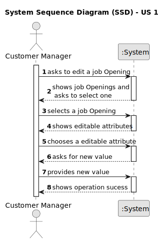
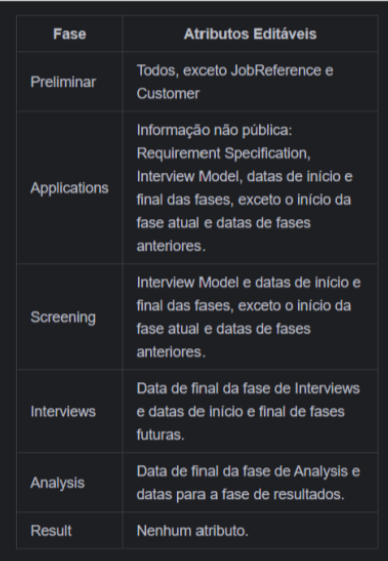
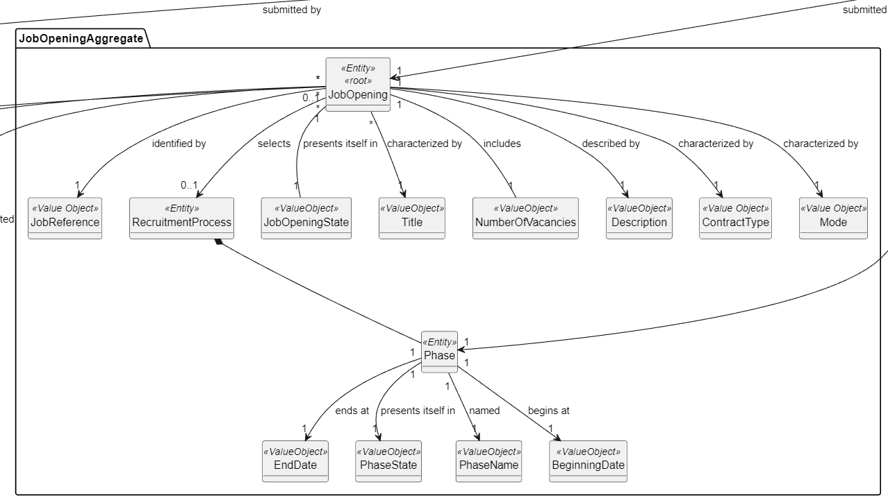
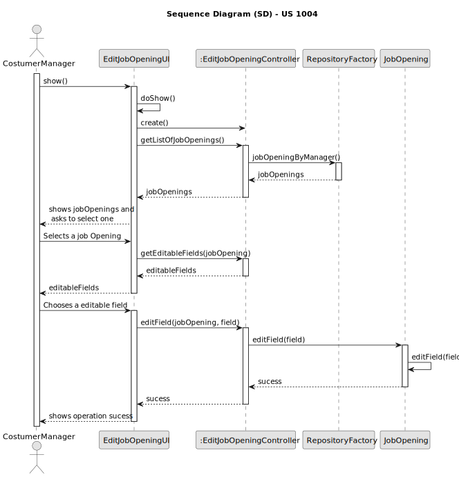

# US 1004

## 1. Context

*This task is being taken for the first time in Sprint C.*

## 2. Requirements

**US 1004** As Customer Manager, I want to edit a job opening.

**Client Acceptance Criteria:**

* Q144 Isabel – US 1004 - Edit a job opening – No seguimento da US 1004 para permitir editar um job opening, estamos a
  assumir que é permitido alterar: Nº de vagas; Morada; Contract Type('FULL_TIME', 'PART_TIME'); Mode ('ON_SITE','
  REMOTE'); Description; Funcao. Estamos na linha de raciocício correta, ou é necessário alterar a lista para incluir
  outra informação adicional ou suprimir alguma desta lista?

* A144 Por favor ver A109 e Q117. Do meu ponto de vista deve ser possível alterar “tudo” exceto o próprio job reference.
  Deve-se ter em conta a manutenção do estado de consistência do sistema.


* Q150 Correia – US 1004 – Quando o Costumer Manager quer editar uma Job Opening, é suposto ele escolher qual Job
  Opening quer editar a partir de uma pesquisa pela referência

* A150 Relacionada com a Q123. A questão refere-se um pouco a boas práticas de UI/UX. O contexto indicado na pergunta
  refere-se a uma situação em que o utilizador tem de identificar a entidade/objeto que deseja editar. Pode-se assumir
  que o utilizador sabe esse identificador. Mas, em termos de UX/UI deve ser possível obter esse identificar por outras
  vias (até porque é um identificar gerado pelo sistema). Penso que, para este caso particular, existe já uma US que
  permite fazer isso.


* Q154 Rodrigo – US 1004 - Em quais ou até que fases de recrutamento de um Job Opening em que pode-se editar as
  informações dela? E quais são as informações que podem ser editadas dentro de uma Job Opening?

* A154 Ver Q144. As alterações devem ser compatíveis com o “momento” em que estamos nessa job opening. Por exemplo, não
  faz sentido alterar o contract type se já estamos a receber candidaturas. Essas candidaturas foram feitas segundo uma
  descrição da oferta de emprego e não faz sentido estar a alterar depois de as pessoas se candidatarem. Mas, por
  exemplo, deve ser possível alterar o job requirements specification (refere-se a outra US) enquanto as pessoas se
  candidatam, pois é um aspeto técnico, que não é do conhecimento público. Portanto, devem ter em conta este tipo de
  preocupações.


* Q156 Rodrigo – US1004 - A cada edição feita de alguma informação numa Job Opening, é necessário registar a data e a
  hora da edição, tal como acontece no momento de registar a Job Opening?

* A156 Não me recordo da indicação de registar data e hora no momento de registar um job opening. Mas sobre este tema, e
  em geral, é comum haver um registo do utilizador que criou ou fez a última atualização de um “registo” no sistema.
  Outra boa prática é as aplicações terem sistemas de log para situações deste género. Mas não me recordo de haver algum
  requisito não funcional que mencione um sistema de log para este nosso projeto (exceto o do application file bot).


* Q193 Bernardo Barbosa – US 1004 - Edit a Job Opening (Active Since e Customer) – Tendo em conta a us1004 já referiu em
  questões passadas que deveria ser possível editar todos os atributos de job Opening , excepto a job Reference. No
  entanto, pergunto se faria sentido editar a data ativa (active since) de uma job Opening uma vez que é um registo
  único de quando a Job Opening ficou ativa. Pergunto também se seria também possível editar o Customer associado a job
  Opening,uma vez que a Job Reference se baseia no Customer. Dada a impossibilidade de edição de Job Reference pergunto
  se faria sentido a edição de customer também.

* A193. Penso que se refere à Q144. Estou de acordo com as suas preocupações. É isso a que me refiro quando na Q144
  escrevo “Deve-se ter em conta a manutenção do estado de consistência do sistema.


* Q203 Bernardo Barbosa – US 1004-Dúvida de Edição Atributos – Como esclareceu na questão 154 no ficheiro de questões,
  mencionou que não faria sentido editar o Contract Type se estivéssemos já na fase de Candidaturas. Pergunto se também
  faria sentido não ser editável nesta fase o Mode, assim como a sua morada e a função (Como "Front-end Programmer"),
  uma vez que são atributos que um candidato tem em mente quando faz uma candidatura a uma Job Opening. Pergunto também
  se o Job Requirements não deveriam ser editáveis a partir da frase screening (assim como o Interview Model na fase
  Interviews) uma vez que esta é a fase em que estes são verificados. Por fim pergunto : O número de vagas é editável em
  todas as fases ?

* A203. No geral o que refere está correto. As informações públicas de uma job opening não devem ser alteradas depois de
  serem tornadas públicas. Quanto a informações não públicas e mais técnicas penso que é aceitável que possam ser
  alteradas se não resultarem em possíveis estados incoerentes do sistema


* Q225 bernardo Barbosa – US 1004 - Editar fase atual- Ao "editar uma JobOpening" seria possível editar a sua fase atual
  nesta user story?

* A225. A intenção desta US é permitir a edição dos dados que caracterizam a job opening do ponto de vista de conceito
  de negócio. A alteração das fases tem uma US especifica.


*

*

**Conclusion:**

* The user should be able to edit jobTitle, description, address, jobOpeningMode, contractType and numberOfVacancies
* The user should not be able to edit jobReference, activeSince, customer
* Depending on the phase of the job opening, the user should not be able to edit certain attributes

## 3. Analysis

### 3.1.Domain model related to US1004



### 3.4.Editable Attributes by phase related to US1004



### 3.4.Domain model related to US1004



## 4. Design

### 4.1. Sequence Diagram

**Follows the same flow for any field to be edited.**



### 4.3. Tests

```
@Test
    void editJobTitleWithValidTitle() {
        String newTitle = "New Title";
        jobOpening.editJobTitle(newTitle);
        assertEquals(newTitle, jobOpening.title());
    }

    @Test
    void editJobTitleWithEmptyTitleShouldThrowException() {
        Assertions.assertThrows(IllegalArgumentException.class, () -> jobOpening.editJobTitle(""));
    }

    @Test
    void editJobTitleWithNullTitleShouldThrowException() {
        Assertions.assertThrows(IllegalArgumentException.class, () -> jobOpening.editJobTitle(null));
    }

    @Test
    void editDescriptionWithValidDescription() {
        String newDescription = "New Description";
        jobOpening.editDescription(newDescription);
        assertEquals(newDescription, jobOpening.description().toString());
    }

    @Test
    void editDescriptionWithEmptyDescriptionShouldThrowException() {
        Assertions.assertThrows(IllegalArgumentException.class, () -> jobOpening.editDescription(""));
    }

    @Test
    void editDescriptionWithNullDescriptionShouldThrowException() {
        Assertions.assertThrows(IllegalArgumentException.class, () -> jobOpening.editDescription(null));
    }

    @Test
    void editAddressWithValidAddress() {
        String newStreet = "New Street";
        String newCity = "New City";
        String newState = "New State";
        jobOpening.editAddress(newStreet, newCity, newState);
        assertEquals(newStreet, jobOpening.address().street());
        assertEquals(newCity, jobOpening.address().city());
        assertEquals(newState, jobOpening.address().state());
    }

    @Test
    void editAddressWithEmptyStreetShouldThrowException() {
        Assertions.assertThrows(IllegalArgumentException.class, () -> jobOpening.editAddress("", "City", "State"));
    }

    @Test
    void editAddressWithEmptyCityShouldThrowException() {
        Assertions.assertThrows(IllegalArgumentException.class, () -> jobOpening.editAddress("Street", "", "State"));
    }

    @Test
    void editAddressWithEmptyStateShouldThrowException() {
        Assertions.assertThrows(IllegalArgumentException.class, () -> jobOpening.editAddress("Street", "City", ""));
    }

    @Test
    void editAddressWithNullStreetShouldThrowException() {
        Assertions.assertThrows(IllegalArgumentException.class, () -> jobOpening.editAddress(null, "City", "State"));
    }

    @Test
    void editAddressWithNullCityShouldThrowException() {
        Assertions.assertThrows(IllegalArgumentException.class, () -> jobOpening.editAddress("Street", null, "State"));
    }

    @Test
    void editAddressWithNullStateShouldThrowException() {
        Assertions.assertThrows(IllegalArgumentException.class, () -> jobOpening.editAddress("Street", "City", null));
    }

    @Test
    void editJobOpeningModeWithValidMode() {
        String newMode = "Part-time";
        jobOpening.editJobOpeningMode(newMode);
        assertEquals(newMode, jobOpening.jobOpeningMode());
    }

    @Test
    void editJobOpeningModeWithEmptyModeShouldThrowException() {
        Assertions.assertThrows(IllegalArgumentException.class, () -> jobOpening.editJobOpeningMode(""));
    }

    @Test
    void editJobOpeningModeWithNullModeShouldThrowException() {
        Assertions.assertThrows(IllegalArgumentException.class, () -> jobOpening.editJobOpeningMode(null));
    }

    @Test
    void editContractTypeWithValidType() {
        String newType = "Temporary";
        jobOpening.editContractType(newType);
        assertEquals(newType, jobOpening.contractType());
    }

    @Test
    void editContractTypeWithEmptyTypeShouldThrowException() {
        Assertions.assertThrows(IllegalArgumentException.class, () -> jobOpening.editContractType(""));
    }

    @Test
    void editContractTypeWithNullTypeShouldThrowException() {
        Assertions.assertThrows(IllegalArgumentException.class, () -> jobOpening.editContractType(null));
    }

    @Test
    void editNumberOfVacanciesWithValidNumber() {
        Integer newNumber = 3;
        jobOpening.editNumberOfVacancies(newNumber);
        assertEquals(newNumber, jobOpening.numberOfVacancies());
    }

    @Test
    void editNumberOfVacanciesWithZeroNumberShouldThrowException() {
        Assertions.assertThrows(IllegalArgumentException.class, () -> jobOpening.editNumberOfVacancies(0));
    }

    @Test
    void editNumberOfVacanciesWithNegativeNumberShouldThrowException() {
        Assertions.assertThrows(IllegalArgumentException.class, () -> jobOpening.editNumberOfVacancies(-1));
    }

    @Test
    void editNumberOfVacanciesWithNullNumberShouldThrowException() {
        Assertions.assertThrows(IllegalArgumentException.class, () -> jobOpening.editNumberOfVacancies(null));
    }

    @Test
    void editJobTitleWithPhaseShouldThrowException() {
        jobOpening.recruitmentProcess().openNextPhase();
        Assertions.assertThrows(IllegalStateException.class, () -> jobOpening.editJobTitle("New Title"));
    }

    @Test
    void editDescriptionWithPhaseShouldThrowException() {
        jobOpening.recruitmentProcess().openNextPhase();
        Assertions.assertThrows(IllegalStateException.class, () -> jobOpening.editDescription("New Description"));
    }

    @Test
    void editAddressWithPhaseShouldThrowException() {
        jobOpening.recruitmentProcess().openNextPhase();
        Assertions.assertThrows(IllegalStateException.class, () -> jobOpening.editAddress("New Street", "New City", "New State"));
    }

    @Test
    void editJobOpeningModeWithPhaseShouldThrowException() {
        jobOpening.recruitmentProcess().openNextPhase();
        Assertions.assertThrows(IllegalStateException.class, () -> jobOpening.editJobOpeningMode("Part-time"));
    }

    @Test
    void editContractTypeWithPhaseShouldThrowException() {
        jobOpening.recruitmentProcess().openNextPhase();
        Assertions.assertThrows(IllegalStateException.class, () -> jobOpening.editContractType("Temporary"));
    }

    @Test
    void editNumberOfVacanciesWithPhaseShouldThrowException() {
        jobOpening.recruitmentProcess().openNextPhase();
        Assertions.assertThrows(IllegalStateException.class, () -> jobOpening.editNumberOfVacancies(3));
    }

    @Test
    void editJobTitleWithNullPhase() {
        jobOpening.recruitmentProcess().complete();
        String newTitle = "New Title";
        Assertions.assertThrows(IllegalStateException.class, () -> jobOpening.editJobTitle(newTitle));
    }

    @Test
    void editDescriptionWithNullPhase() {
        jobOpening.recruitmentProcess().complete();
        String newDescription = "New Description";
        Assertions.assertThrows(IllegalStateException.class, () -> jobOpening.editDescription(newDescription));
    }

    @Test
    void editAddressWithNullPhase() {
        jobOpening.recruitmentProcess().complete();
        String newStreet = "New Street";
        String newCity = "New City";
        String newState = "New State";
        Assertions.assertThrows(IllegalStateException.class, () -> jobOpening.editAddress(newStreet, newCity, newState));
    }

    @Test
    void editJobOpeningModeWithNullPhase() {
        jobOpening.recruitmentProcess().complete();
        String newMode = "Part-time";
        Assertions.assertThrows(IllegalStateException.class, () -> jobOpening.editJobOpeningMode(newMode));
    }

    @Test
    void editContractTypeWithNullPhase() {
        jobOpening.recruitmentProcess().complete();
        String newType = "Temporary";
        Assertions.assertThrows(IllegalStateException.class, () -> jobOpening.editContractType(newType));
    }

    @Test
    void editNumberOfVacanciesWithNullPhase() {
        jobOpening.recruitmentProcess().complete();
        Integer newNumber = 3;
        Assertions.assertThrows(IllegalStateException.class, () -> jobOpening.editNumberOfVacancies(newNumber));
    }
````