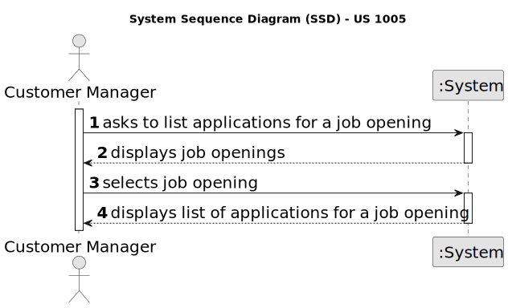

# US 1005

## 1. Context

*This task is being taken for the first time in Sprint B.*

## 2. Requirements

**US 1005** As Customer Manager, I want to list all applications for a job opening.

**Acceptance Criteria:**

Q63 Gonçalves –US1005. Relativamente aos critérios para a listagem das candidaturas: Devem aparecer candidaturas que estão a decorrer ou podem aparecer candidaturas feitas no passado? Podem aparecer quaisquer candidaturas ou apenas as que tenham sido aceites? Que informação deverá ser mostrada em cada candidatura?

A63. Tal como refere a descrição da US, devem ser listadas todas as candidaturas para um job opening. Faz sentido mostrar todas as candidaturas, independentemente do seu estado. Assim, para cada cada candidatura deve ser identificado o candidato e o estado da sua candidatura.

Q76 Abreu – US1005 – A lista deve conter applications que ainda não concluíram todo o processo de seleção definido no setup da Job Opening ? Se sim, a lista deve conter o estado/fase de cada application?

A76. O processo de seleção/recrutamento termina apenas no “fim”, pelo que não percebo muito bem a primeira pergunta. Quanto à segunda pergunta penso que faz sentido incluir o estado da aplicação, até para o Customer Manager perceber as applications que foram rejeitadas por não passarem os requisitos.

Q127 Guedes – US1005- Quando queremos listar applications temos de escolher de qual job opening vai ser. Como é que o costumer manager escolhe a job opening? Listamos todas as job openings que pertencem aos costumers que ele está responsável, para que ele escolhe uma?

A127. Pergunta similar à Q123.

Q129 Pinto – US1005- O customer manager vai receber a lista de todas as job Openings e selecionará uma, feito isto deve aparecer as job applications correspondentes. Que informações das job applications tem que ser mostradas ao listar?

A129. As candidaturas são de um candidato (pessoa), pelo acho que deve aparecer a identificação da candidatura (application), assim como a identificação do candidato e o seu nome.

## 3. Analysis

