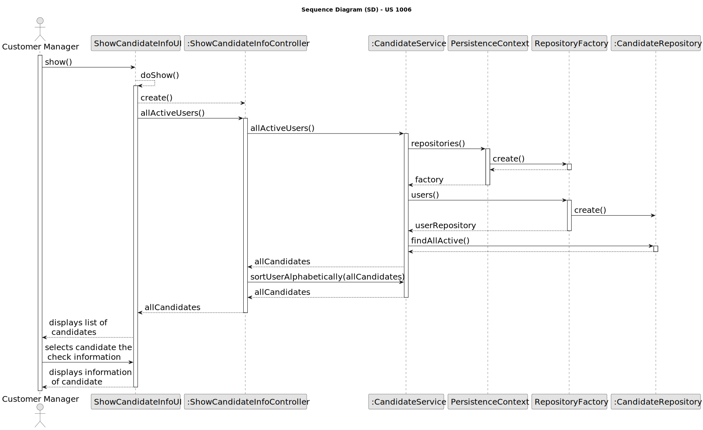

# US 1006

## 1. Context

*This task is being taken for the first time in Sprint B.*

## 2. Requirements

**US 1006** As Customer Manager, I want to display all the personal data of a candidate

**Client Acceptance Criteria:**

* Q75: US1006 – Em relação à listagem dos dados pessoais de um determinado candidato, um customer manager vai ter
* acesso a todos os candidatos do sistema ou apenas aos candidatos que submeteram uma application para uma job
* opening de um cliente que é gerido por esse customer manager?

* A75: No contexto actual vamos assumir que o Customer Manager pode aceder (consultar) os dados pessoais de qualquer
* candidato.

* Q42: US1006, Qual a informação do nome do candidato deve aparecer (nome completo, primeiro e ultimo nome , etc)?

* A42: À partida diria que seria o nome, tal como foi recebido na application que fez (página 6, “name of the
* candidate”

## 3. Analysis

## 4. Design

### 4.1. Sequence Diagram

