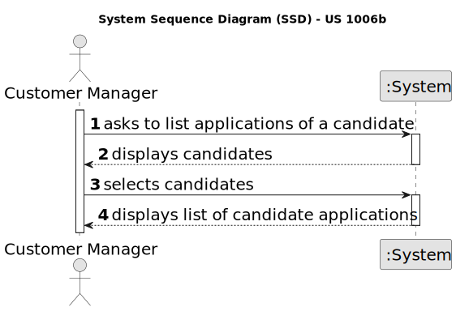

# US 1006b

## 1. Context

*This task is being taken for the first time in Sprint B.*

## 2. Requirements

**US 1006b** As Customer Manager, I want to display all the personal data of a candidate,
including his/her applications.

**Acceptance Criteria:**

Q108 José – US1006b- Quanto á informação que é apresentada na 1006b, que tipo de informação relacionada ás "applications" do candidato espera que seja apresentada ao customer manager?

A108 Espera-se que sejam listadas as candidaturas desse candidato indicando a que job opening, qual a data de registo da candidatura, o seu estado e qual o seu identificador.

Q42 Bernado – US1006, Qual a informação do nome do candidato deve aparecer (nome completo, primeiro e ultimo nome , etc)?

A42. À partida diria que seria o nome, tal como foi recebido na application que fez (página 6, “name of the candidate”)

Q75 Silva – US1006 – Em relação à listagem dos dados pessoais de um determinado candidato, um customer manager vai ter acesso a todos os candidatos do sistema ou apenas aos candidatos que submeteram uma application para uma job opening de um cliente que é gerido por esse customer manager?

A75. No contexto actual vamos assumir que o Customer Manager pode aceder (consultar) os dados pessoais de qualquer candidato.

Q90 Matilde – US1006 – Em relação ao processo de selecionar um candidato e mostrar a sua informação pessoal, para facilitar a procura de um candidato especifico. Faria sentido perguntar ao utilizador se quer listar todos os candidatos existentes ou se quer reduzir a lista, selecionando um job opening e assim mostrar todos os candidatos para esse job opening, e por fim selecionar um candidato dessa lista mais pequena?

A90. O product owner espera que o sistema aplique as melhores práticas de UI/UX mas, não sendo especialista nessa área técnica, não arrisca sugerir soluções.

Q108 José – US1006b- Quanto á informação que é apresentada na 1006b, que tipo de informação relacionada ás "applications" do candidato espera que seja apresentada ao customer manager?

A108 Espera-se que sejam listadas as candidaturas desse candidato indicando a que job opening, qual a data de registo da candidatura, o seu estado e qual o seu identificador.

Q113 Beatriz – US1006 - Informações do candidato - Na us1006 é necessário mostrar os dados pessoais dos candidatos. Para isso, que informações acha pertinente demonstrar?

A113. Será toda a informação pessoal de um candidato que o sistema tenha registado.

Q128 Rocha – US1006- Na us 1006, seria aceitavel perguntar ao costumer manager o id do candidato de que deseja visualizar os dados, ou seria mais pertinente dar uma lista de todos os candidos e deixa-lo escolher dessa lista, assumindo que este não tem maneira de saber o id do candidato de que quer obter dados.

A128. Pergunta similar à anterior Q127. Note-se que a US1005 permite obter as candidaturas para uma job opening. Esta US é para mostrar os dados de um candidato. Portanto parece existir forma de aceder ao id do candidato, caso não se saiba qual é. Mais uma vez, espero que apliquem boas práticas de UI/UX.

Q136 Padilla – US200a, US1006 - I have understood that the registration of the candidate will always be done by the operator. I also have read this line in the documentation "The Operator of the Backoffice will import the files produced by the Applications File Bot and register the applications, creating candidates that dot not exist in the system" So I guess the mechanism that the Operator follows is display all the data of a candidate (US 1006), and if the system shows "this cadidate doesn't exit", the operator click in registering candidate (US 2000A) and then he/she registers the aplication, isn't it? Apart, could the Operator upload the CV of the candidate in the registering operation? or should it be done by the candidate in his/her console?

A136. Please see Q74 and all the others that refer to US2002. US2002 regards the import of the files that result from the Application File Bot. This import results in the creation of the respective applications in the system and possible creation of candidate user if it does not exist already. This is to be done automatically, without intervention of the operator. If, for some reason, the process encounters any problem (e.g., missing candidate date) it should interrupt the import a log/inform the operator. There is no US for the candidate to upload his/her CV. This is only done by email. Also, there is no US (apart from US2002) to import data from candidates.

## 3. Analysis

