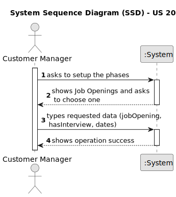
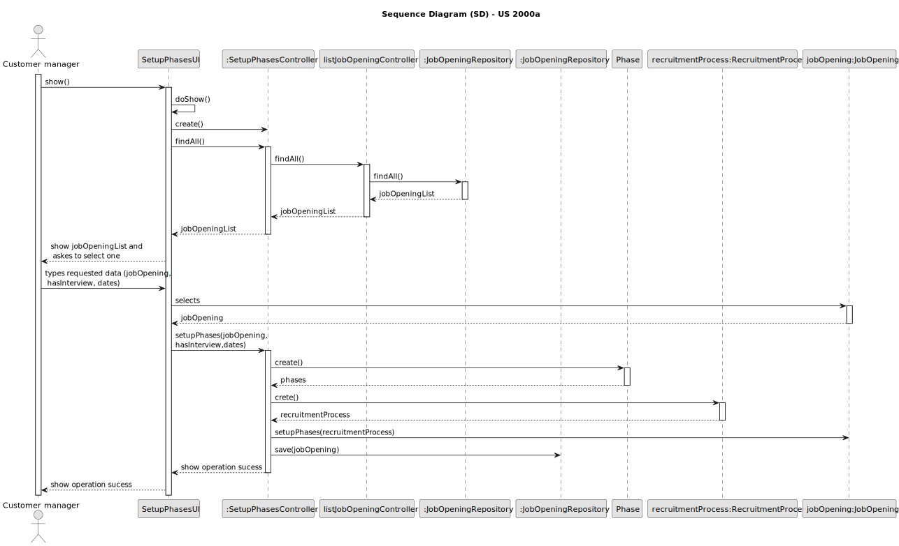

# US 1007

## 1. Context

*This task is being taken for the first time in Sprint B.*

## 2. Requirements

**US 1007** As Customer Manager, I want to setup the phases of the process for a job opening.

**Client Acceptance Criteria:**

* Q16 Beatriz – Relativamente à secção 2.2.1 e às fases do processo de recrutamento, para passarmos para a fase seguinte a anterior tem de fechar ou podemos avançar sem ter a anterior fechada?

* A16 A resposta curta é que as fases devem ser sequenciais e não sobrepostas. Quando fecha uma fase abre a próxima. A US 1007 prevê a definição das fases. A US 1010 prevê a abertura e fecho de fases do processo. A decisão do Customer Manager de fechar uma fase deve assumir que o processo avança para a próxima fase automaticamente (independentemente das datas definidas para as fases).


* Q46 Beatriz – US1007, o identificar do processo de recrutamento pode ser um numero automático ou seja mais especifico

* A46. O job opening tem um identificar. O processo de recrutamento de um job opening é um “tributo” desse job opening. À partida não vejo necessidade de ter um identificador “especial” para o processo de recrutamento (i.e., fases do processo de recrutamento desse job opening).


* Q53 Bernardo – O recruitment process pode ser identificado pelo job reference?

* A53. A US 1007 refere que quando o Customer Manager vai definir as fases do recrutamento para cada job opening. Penso que não haverá necessidade de ter um identificar explicito para o processo de recrutamento, uma vez que apenas existe um para cada job reference e é especifico de cada job reference. Em termos técnicos, se houver necessidade de um ID para o processo de recrutamento, não tenho nada contra que este seja igual ao job reference.


* Q62 Gonçalves –US1007/US1010. Segundo estas US's e a Q16, cada Job Opening deve ter fases definidas. Nas perguntas Q23, Q32 e Q45 é referido o estado da candidatura. A fase da Job Opening e o estado da candidatura são conceitos separados ou referem-se ao mesmo?

* A62. Tal como referido anteriormente, estão relacionados mas são conceitos diferentes.


* Q73 Castro – US1007 – Em termos de user interface, neste caso para o customer manager como é que deverá ser realizado o setup do recruitment process.

* A73. Não tenho requisitos específicos para a user interface. Deve usar princípios de boas práticas de desenho de user interfaces tendo em conta “The customer manager is responsible to setup the process, defining the dates for the phases and if the process includes interviews” (secção 2.2.1)


* Q85 Leite – US1007/1009 – Depois de definir os estados de recrutamento para uma JobOpening, o Customer Manager poderá selecionar o Job Requirement Specification para esse mesmo Job Opening? Se sim, até que fase de recrutamento poderá executar a ação?

* A85. O Customer Manager define as fases do processo de recrutamento, não define os estados. A avaliação de requisitos é feita na fase de Screening. Assim, não percebo bem a questão colocada.


* Q91 Varela – [1002, 1007, 1009] - Validez de uma Job Openings – A nossa questão principal seria: quando é que uma job opening é considerada válida? Tendo em conta as funcionalidades 1002, 1007, 1009, surgiu-nos uma duvida relativamente às job openings e à sua constituiçao. Na US1002, é suposto resgistar uma job opening e apenas depois, na US1009, devemos selecionar os requirements specifications para a dada job opening. Posto isto, aquando o registo da job opening, esta não iria possuir toda a informaçao obrigatória como requerido. Assim sendo, deveria haver uma ligação direta entre estas user stories de forma a que, aquando o registo, passamos automaticamente a selecionar os requirements obtendo assim uma job opening válida? Adicionalmente, queremos esclarecer se o recruitment process é algo obrigatório para a validez de um job opening.

* A91. O product owner não é especialista do dominio da solução (apenas têm conhecimentos do problema) mas, quanto à primeira questão, sugere que talvez user stories não sejam (podem não ser) opções de menu “distintas”. Quanto à segunda questão (recruitment process) julgo que também está mais ligada à solução que ao problema, pelo que não vou sugerir nada que possa até complicar mais do que esclarecer.


* Q92 Varela – [1007, 1011] - Processo de Setup de uma Job Opening – Tendo em conta a US1007, de setup das diferentes fases do processo de recrutamento, gostaríamos que nos fosse esclarecido se, caso seja selecionada uma fase de Interview, é necessário haver uma ligação direta com a US1011, seleção de um interview model, ou serão funcionalidades separadas? Na eventualidade de serem separadas, passa então um recruitment process a ser válido apenas após a seleção de um interview model?

* A92. Suponho que a minha reposta seja similar à da pergunta anterior (Q91). Posso adiantar que podemos considerar que a empresa para já pretende usar sempre um processo de avaliaçao de entrevistas “automático”, pelo que este deve estar definido para se poderem “executar/processar” as entrevistas.


* Q103 Isabel – US1007 – Para um recruitment process vamos ter várias fases. O que é pretendido para o “Setup”?

* A103 Ver Q73. O processo de recrutamento, explicado na secção 2.2.1, define uma sequência de fases na qual apenas se indica como opcional a fase das entrevistas. O Setup consiste essencialmente em definir as datas para cada fase e se temos ou não a fase das entrevistas.


* Q115 Paula – US1002, 1007, 1009 - Na US1002 ao registar um job opening é imperativo selecionar também o job requirement e/ou as fases de recrutamento?

* A115. São US diferentes e, do meu ponto de vista, podem ser executadas em momentos diferentes. Apenas lembro que, como é evidente, desejo que o sistema esteja sempre num estado consistente.


* Q116 Fábio – US1007 - Definir datas das fases- As fases do processo de recrutamento têm que ter datas atribuidas. É possivel terminar uma fase e começar outra no mesmo dia?

* A116. Ver Q16. Não deve haver sobreposição de datas, mas podemos permitir que terminem e acabem no mesmo dia (ex: uma termina de manhã e a seguinte inicia-se de tarde).


* Q123 Guedes – US1007- Quando o customer manager quer dar setup das fases de uma job opening, como é que ele escolhe a mesma? Lista-se todas as job openings de todos os customers que ele é responsável? Ou lista-se todos os customers e ele seleciona o desejado e só depois seleciona a Job Opening?

* A123. Eu queria evitar constrangir a forma como desenham a UI/UX (para esta ou outras US). Penso que devem usar as melhores práticas. Como product owner gostava que aplicassem as melhores praticas supondo que essas melhoram a interação dos utilizadores. Note ainda que existe a US1003.


* Q126 Abreu (questão registada a 2024-04-17 no forum) – US1007- Um costumer manager deve conseguir fazer setup a todas os Job Openings disponíveis no sistema ou apenas as que ele registou(US1002) ?

* A126. Deve fazer o Setup dos job openings do qual é responsável (que está a gerir).

## 3. Analysis



## 4. Design

### 4.1. Sequence Diagram



### 4.2. Tests

**Refers to Client Acceptance Criteria:** A16

```
    @Test
    public void testConstructorWithValidArguments() {
        JobReference jobReference = new JobReference("ISEP","123");
        Description description = Description.valueOf("Test description");
        Address address = new Address("123 Street", "City", "state");
        String jobOpeningMode = "Full-time";
        String jobTitle = "Software Engineer";
        String jobOpeningState = "Open";
        String contractType = "Permanent";
        Integer numberOfVacancies = 2;
        SystemUser manager = getNewCustomerUser();
        Customer customer = new CustomerBuilder().withCustomerCode("IGUAL").withSystemUser(getNewCustomerUser())
                .withAddress("street", "city", "state").withManager(getNewCustomerUser()).build();

        JobOpening jobOpening = new JobOpening(jobReference, description, address, jobOpeningMode, jobTitle, jobOpeningState,
                contractType, numberOfVacancies, manager, customer);

        assertNotNull(jobOpening);
    }

    @Test
    public void testConstructorWithNullArguments() {
        assertThrows(IllegalArgumentException.class, () -> {
            new JobOpening(null, null, null, null, null, null, null, null, null, null);
        });
    }

    @Test
    public void testConstructorWithSomeNullArguments() {
        JobReference jobReference = new JobReference("ISEP","123");
        Description description = Description.valueOf("Test description");
        Address address = new Address("123 Street", "City", "Country");
        String jobOpeningMode = "Full-time";
        String jobTitle = "Software Engineer";
        String jobOpeningState = "Open";
        String contractType = "Permanent";
        Integer numberOfVacancies = 2;
        Customer customer = new CustomerBuilder().withCustomerCode("IGUAL").withSystemUser(getNewCustomerUser())
                .withAddress("street", "city", "state").withManager(getNewCustomerUser()).build();

        assertThrows(IllegalArgumentException.class, () -> {
            new JobOpening(jobReference, description, address, jobOpeningMode, jobTitle, jobOpeningState,
                    contractType, numberOfVacancies, null, customer);
        });
    }
```
