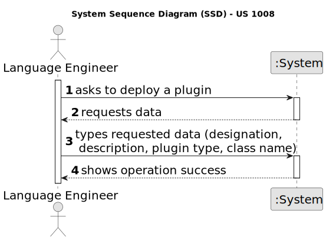
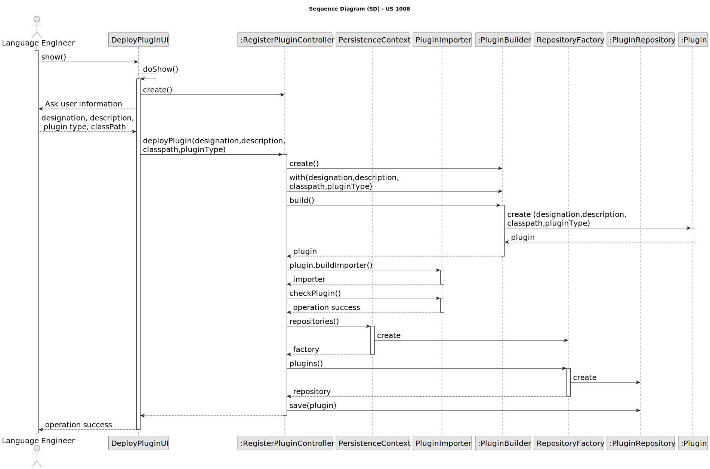

# US 1008

## 1. Context

*This task is being taken for the first time in Sprint B.*

## 2. Requirements

*In this section you should present the functionality that is being developed, how do you understand it, as well as
possible correlations to other requirements (i.e., dependencies). You should also add acceptance criteria.*

**US 1008** As Language Engineer, I want to deploy and configure a plugin (i.e., Job Requirement Specification or
Interview Model) to be used by the system.

**Client Acceptance Criteria:**

* Q38: Cada questão de um interview model aceita um x tipos de respostas(ex escolha múltipla) ou é a interview model que
  aceita um x tipos de respostas em todas as suas questões? Assumimos que uma job opening só segue um interview model?

* A38: Sim, cada pergunta/resposta aceita um tipo de pergunta/resposta (um dos tipos que aparece no inicio da página 8).
  Na US1011, o Customer manager seleciona o interview model a usar nas entrevistas para um job opening. Ou seja,
  existirá apenas um interview model a usar nas entrevistas desse job opening.


* Q40: Uma entrevista pode ter apenas uma questão? US1014, time and date, quer dizer data de inicio e não data final?
  Podem haver entrevistas em paralelo?

* A40: Quanto ao número de perguntas numa entrevista, não está definido nenhum limite inferior ou superior. Ou seja,
  pode haver uma entrevista com apenas 1 pergunta (não fará sentido não ter perguntas). A US1014 refere-se à marcação da
  data de uma entrevista com um candidato. Algo como indicar o dia e a hora (ex: 23 de abril pelas 14:00). Em relação à
  marcação de entrevistas “sobrepostas” (com a mesma data de inicio), neste momento, seria algo a permitir (pode, por
  exemplo, o customer manager delegar noutra pessoa a condução da entrevista). Isso não invalida que devam validar se as
  entrevistas ocorrem dentro da fase das entrevistas.


* Q41: Como é que o Language Engineer faz o interview model e os job requirements? É texto? Ou ele seleciona perguntas
  para a interview e requirements para a job opening? E isso é quando se está a criar uma entrevista ou uma job opening
  ou para-se a meio para fazer isso e depois continua se?

* A41: O language enginner com informação passada pelo customer manager (que obteve do customer) vai desenvolver em java
  um jar correspondente ao modulo/plugin. Para esse desenvolvimento terá de utilizar técnicas de desenvolvimento de
  gramáticas/linguagens como o antlr. Esse código ficará num jar que depois o language engineer “instala/regista” na
  aplicação (US1008, por exemplo, associando um nome ao jar num ficheiro de configuração – “5 anos experiencia java”,
  “req-model-5-years-java.jar”). A aplicação com essa informação carrega dinamicamente esse jar. Na gramátca usada no
  jar é que vão estar espelhadas a estrutura das perguntas a usar nesse modelo e sua avaliação. Estas atividades têm de
  ser feitas antes de se poder fazer a US1008. Esse trabalho é feito “fora” dos sistema, apenas se registando o modelo (
  quando está pronto) na US1008. A US 1009 e US1011 permitem selecionar modelos a usar (dos que foram devidamente
  registados no sistema).


* Q47: US1008, relativamente aos módulos das entrevistas e dos requisitos, os seus identificadores podem ser automáticos
  ou específicos (i.e., manuais)?

* A47: A Q41 refere a mesma US. Lá refere-se que cada modulo será registado no sistema através de 2 dados, por exemplo,
  associando um nome ao jar num ficheiro de configuração – “5 anos experiencia java”, “req-model-5-years-java.jar”. Ou
  seja, assume-se que cada modulo terá um nome/designação (que suponho que deverá ser única) e a este nome ficará
  associado o nome do ficheiro jar (provavelmente um path completo) que implementa esse módulo. Ou seja, esse
  nome/designação pode ser considerado como um identificador especifico/manual.


* Q121: US 1008 Perguntas para os plugins.- É possível esclarecer-nos se as perguntas a serem feitas para os Interview
  Models e os Requirement Especifications são aquelas que estão no exemplo da documentação ou tem algum grupo de
  questões que gostaria que nós utiliza-se-mos?

* A121: O documento de especificação apresenta, como disse, exemplos. São apenas exemplos indicativos. Podem usar esses
  exemplos como casos de teste e como ponto de partida para definirem outros. Mas é suposto a solução suportar mais do
  que apenas os exemplos que estão no documento. Em qualquer dos plugins, o tipo de perguntas que deve ser suportado é o
  que está apresentado na página 8 do documento. Como product onwer eu gostaria que uma demonstração funcional do
  sistema incluísse pelo menos 2 plugins de cada tipo, para se poder demonstrar, minimamente, o suporte para mais do que
  um plugin usado (de cada tipo) em simultâneo. Deve ainda demonstrar o uso de todos os tipos de perguntas apresentados
  na página 8 (atualizado em 2024-04-27).


* Q124: US1008 - Na US1008, o deployment do jar file (plugin) é suposto ser armazenado na base de dados? De que forma
  vamos manter o plugin após diferentes utilizações? Ou devemos armazenar uma string para o path do jar file?

* A124: Esta questão é um pouco técnica. Como cliente o que eu pretendo é que seja possível usar vários módulos (
  plugins). Não me parece que seja necessário armazenar os plugins na base de dados. Até poderia ser feito, mas não
  vamos por ai. Um plugin pode ser visto como parte do código da aplicação que é “feito” depois da aplicação estar em
  produção, podendo-se acrescentar “funcionalidade” à aplicação sem ter de gerar uma nova versão da aplicação, por
  intermédio da instalação de plugins. Sendo código. As suas versões são geridas como o restante código, num repositório
  de código fonte. Mas estou a entrar em considerações técnicas que queria evitar. Para questões técnicas existe outro
  fórum e existem os docentes das UC.


* Q132: US1008 - US2003 - Usage of ANTLR- Is it possible to clarify the usage of ANTRL within user story 2003? You've
  stated in Q15, Q102 and Q119, that US2003 simply generates the file, while in US2004 the Operator defines the answers
  and uploads the file. Where is this file uploaded to? Given this, where is the usage of ANTRL in US2003 directed to?

* A132: Regarding the first question, although difficult it is possible to generate the template text file using ANTLR.
  If so, there we have the usage o ANTLR. Although, unless there is some specific evaluation requirement from LPROG, it
  is acceptable that the template file is hardcoded in the plugin (no need for any “complex” generation
  process/function). Regarding the second question, the file is uploaded to the system. The last question was answered
  first.

**Dependencies/References:**

* Regarding US, it has references to the LPROG NFR09.

## 3. Analysis



## 4. Design

In order to implement this US, a UI was implemented for the language engineer to introduce the necessary data fo the
deployment of a plugin in the system.
This data will then be passed to a controller in which the plugin will be created. The class responsible for the plugin
will then execute a checking method and if it passes then it is persisted in system.

### 4.1. Sequence Diagram



### 4.2. Tests


```
@Test
    public void ensurePlugInEqualsPassesForTheSamePlugin() throws Exception {

        final PlugIn aPlugin = new PluginBuilder().withDesignation(Designation.valueOf("IGUAL")).
                withDescription(Description.valueOf("descrição")).withType(PluginType.INTERVIEW_MODEL)
                .withClass(FQClassName.valueOf("path")).build();

        final PlugIn anotherPlugin = new PluginBuilder().withDesignation(Designation.valueOf("IGUAL")).
                withDescription(Description.valueOf("descrição")).withType(PluginType.INTERVIEW_MODEL)
                .withClass(FQClassName.valueOf("path")).build();


        final boolean expected = aPlugin.equals(anotherPlugin);

        assertTrue(expected);
    }


    @Test
    public void ensurePluginEqualsFailsForDifferentDesigantion() throws Exception {
        final PlugIn aPlugin = new PluginBuilder().withDesignation(Designation.valueOf(aDesignation)).
                withDescription(Description.valueOf("descrição")).withType(PluginType.INTERVIEW_MODEL)
                .withClass(FQClassName.valueOf("path")).build();

        final PlugIn anotherPlugin = new PluginBuilder().withDesignation(Designation.valueOf(anotherDesignation)).
                withDescription(Description.valueOf("descrição")).withType(PluginType.INTERVIEW_MODEL)
                .withClass(FQClassName.valueOf("path")).build();

        final boolean expected = aPlugin.equals(anotherPlugin);

        assertFalse(expected);

    }

    @Test
    public void ensurePluginEqualsFailsForDifferenteObjectTypes() throws Exception {

        final PlugIn aPlugin = new PluginBuilder().withDesignation(Designation.valueOf(aDesignation)).
                withDescription(Description.valueOf("descrição")).withType(PluginType.INTERVIEW_MODEL)
                .withClass(FQClassName.valueOf("path2")).build();

        final PlugIn anotherPlugin = new PluginBuilder().withDesignation(Designation.valueOf(anotherDesignation)).
                withDescription(Description.valueOf("descrição")).withType(PluginType.REQUIREMENTS_SPECIFICATION)
                .withClass(FQClassName.valueOf("path1")).build();

        @SuppressWarnings("unlikely-arg-type") final boolean expected = aPlugin.equals(anotherPlugin);

        assertFalse(expected);
    }

    @Test
    public void ensurePluginIsTheSameAsItsInstance() throws Exception {

        final PlugIn aPlugin = new PluginBuilder().withDesignation(Designation.valueOf(aDesignation)).
                withDescription(Description.valueOf("descrição")).withType(PluginType.INTERVIEW_MODEL)
                .withClass(FQClassName.valueOf("path2")).build();

        final boolean expected = aPlugin.sameAs(aPlugin);

        assertTrue(expected);
    }


    @Test
    public void ensureTwoPluginsWithDifferentDesignationAreNotTheSame() throws Exception {

        final PlugIn aPlugin = new PluginBuilder().withDesignation(Designation.valueOf(aDesignation)).
                withDescription(Description.valueOf("descrição")).withType(PluginType.INTERVIEW_MODEL)
                .withClass(FQClassName.valueOf("path2")).build();

        final PlugIn anotherPlugin = new PluginBuilder().withDesignation(Designation.valueOf(anotherDesignation)).
                withDescription(Description.valueOf("descrição")).withType(PluginType.REQUIREMENTS_SPECIFICATION)
                .withClass(FQClassName.valueOf("path1")).build();

        final boolean expected = aPlugin.sameAs(anotherPlugin);

        assertFalse(expected);
    }
````