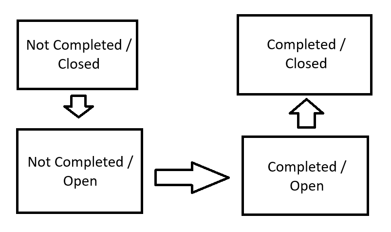

# US 1010

## 1. Context

*This task is being taken for the first time in Sprint C.*

## 2. Requirements

**US 1010** As Customer Manager, I want to open or close phases of the process for a job
opening.

**Client Acceptance Criteria:**

* Q16 Beatriz – Relativamente à secção 2.2.1 e às fases do processo de recrutamento, para passarmos para a fase seguinte
  a anterior tem de fechar ou podemos avançar sem ter a anterior fechada?

* A16 A resposta curta é que as fases devem ser sequenciais e não sobrepostas. Quando fecha uma fase abre a próxima. A
  US 1007 prevê a definição das fases. A US 1010 prevê a abertura e fecho de fases do processo. A decisão do Customer
  Manager de fechar uma fase deve assumir que o processo avança para a próxima fase automaticamente (independentemente
  das datas definidas para as fases).


* Quando o Customer Manager deseja abrir ou fechar uma fase de recrutamento, este deve ter a oportunidade de escolher
  qual fase deseja abrir ou fechar, ou automaticamente ele avança para a próxima fase, isto é fecha a fase atual e abre
  a seguinte.

* A143 Já respondida em Q16. Mas, resumindo, a ideia desta US é permitir avançar nas fases de um job opening. As fases
  devem ser sempre sequenciais. Podemos considerar que o fecho de uma fase resulta na abertura da fase seguinte (e o
  avançar para a fase seguinte, significa fechar a anterior). Não deve ser possível “saltar” fases, a não ser fases que
  não façam parte do processo (por exemplo, se não tiver entrevistas).


* Q147 Andre – US 1010 – gostaria de saber em quê que consiste abrir ou fechar as fases de uma job opening, tendo em
  conta a US1007 as datas já foram definidas para cada fase.

* A147 Por favor ver Q16 (e outras perguntas sobre o mesmo tema). Esta US permite que o processo mude de fase (
  tipicamente para avançar no processo). As fases têm datas mas, como referido em Q16, podemos “ativar” uma fase mesmo
  que ainda não estejamos no seu intervalo temporal. As datas das fases são “indicativas”, no sentido em que sugerem, em
  particular ao Customer Manager, como gerir temporalmente o processo. Existem “operações” que devem acontecer quando a
  fase respetiva esta “ativa”.


* Q149 Pedro – US 1010 – No ultimo sprint foi definido as datas em que começa cada fase de uma job opening, neste é
  possivel fechar e abrir fases. A minha pergunta seria a seguinte, caso se queira fechar uma fase antes da seguinte
  começar, o inicio dessa seguinte fase é antecipado? No cenário que já tenho passado a data de inicio de uma fase y
  tendo a x (antecessora) sido fechado, caso se queira re-abrir a fazer x, é possivel? Ou o sistema deve proibir essa
  tentativa visto violar as datas definidas?

* A149 Ver Q147 e Q16. A “mudança” de fases para “recuar” deve ser possível caso a fase que se deseje “abandonar” ainda
  não esteja, de facto, a ser “executada/ativa”. Por exemplo, se estou na fase de screening e já comecei a verificar
  requisitos de candidatos não faz sentido poder “regressar” à fase de application. Mas se eu estava na fase de
  application e decidi passar para a próxima (de screening) e passado algum tempo quero regressar à anterior (por
  exemplo, porque me enganei e ainda estou a receber candidaturas), devo poder faze-lo se ainda não tiver feito nenhuma
  “operação/processamento” especifico da fase de screening. No que se refere ao avançar deve-se aplicar um principio
  semelhante: deve ser possível avançar para a próxima fase se a anterior estiver “concluída”, por exemplo, posso
  avançar para as entrevistas se o screening estiver concluído, ou seja, se todos os candidatos foram verificados e
  notificados. Tipicamente/normalmente, as fases são para avançar de forma sequencial.


* Q153 José – US 1010 - Na US 1010, considerando que quando fechamos uma fase a próxima começa, quando consideramos o
  caso de chegarmos á ultima fase, quando fecharmos a fase devemos também mudar o estado do job opening?

* A153 Ver Q151. Quanto à segunda questão, quando se fecha a última fase de um processo esse processo termina, ou seja,
  esse job opening já não está “activo”.


* Q161 Castro – US1010 - O sistema para a Us1010 deve fazer validações de, por exemplo, o utilizador não pode abrir a
  fase de interview se o interview model ainda não tiver sido definido, ou o utilizador pode mudar de fase mas não vai
  conseguir, neste caso, executar o processo de avaliação de entrevistas enquanto não tiver um interview specification
  atribuído?

* A161 Penso que poderá fazer isso. O que não deve conseguir é fazer entrevistas sem ter o interview model especificado.


* Q168 Francisco – US1010 – O utilizador deve escolher a fase que quer abrir ou fechar?

* A168 Sem querer condicionar a UI/UX, penso que uma possibilidade seria o sistema apresentar a fase atual do processo e
  indicar o que é possível fazer. Se for possível avançar ou recuar, deve indicar que é possível e qual a fase
  resultante. Se não (ainda) possível avançar/recuar deve indicar a justificação desse facto.


* Q171 Rodrigo – US1010 - Consideramos que uma fase "open" não é o mesmo que uma fase "active". A fase "open" é uma fase
  que está disponível para ser executada, enquanto que a fase "active" é uma fase que está a ser executada. Concorda com
  esta distinção? Porque se o sistema quando fecha uma fase automaticamente considera a fase seguinte como "open" e se "
  open" for o mesmo que "active/in progress" então nunca vai ser possível "recuar" de fase

* A171 Sim, penso que o que refere está de acordo com o que tentei explicar nas perguntas anteriores sobre esta US. Usei
  o termo “open” e “close” para indicar a abertura e o fecho das fases. Usei o termo “active” para indicar que alguma
  operação especifica da fase já teria sido executada (ou estava em execução) e consierava então essa fase como
  “activa”, o que significava que não podia mudar de fase enquanto essas “operações” não terminassem.


* Q194 Beatriz Silva – 1010 - Open or close phases of the process for a job opening – Para esta User Story, considerando
  que a fase de "Application" foi fechada em 19/05 e atualmente estamos na fase de "Screening". Caso seja necessário
  retroceder para a fase anterior, as datas devem ser ajustadas? Uma vez que pode afetar as datas das fases subsequentes
  que ainda não foram iniciadas.

* A194. A possibilidade indicada anteriormente que permite “retroceder” nas fases deve ser considerada excecional, mas
  possível se garantida a consistência do sistema. Quando isso acontece não estou a ver necessidade de ajustar datas.


* Q200 Rodrigo Pinto – US 1010 - Ciclo de uma "Job Offer" – Venho por este meio questionar se é correto considerar que o
  ciclo de uma "job offer" é o seguinte: Ou seja, uma job offer no momento em que é criada fica no estado "Waiting", de
  seguida quando o customer manager "abre" a fase de candidaturas (Application) o estado da job offer passa a ser "
  open", de seguida esta mesma job offer tem de passar pelas 4 (ou 5) fases de recrutamento (
  Application,Screening,Interview,Analysys e Result) sendo que cada uma tem as suas regras, por exemplo não é possível
  avançar para a fase de screening se o customer manager ainda não tiver escolhido o plugin que deve ser usado para este
  efeito (us 1009). Por fim, depois destas 4/5 fases a job offer passa ao seu estado final que é closed. Posto isto,
  questiono novamente, se este "ciclo" de vida de uma job offer é correto?

* A200. Parece-me que o diagrama e a sua descrição contemplam o essencial do que já foi discutido.


* Q201 Rodrigo Castro – US1010 – Em termos de estados da fase, os estado concluída e fechada são sinónimos ou
  representam conceitos diferentes? Deu um exemplo para a fase de "screening" que encontra-se concluída quando todos os
  candidatos forem verificados e notificados. Consegue dar uma explicação para as outras fases existentes, quando é que
  as podemos considerar fechadas.?

* A201. Quando, em questões anteriores sobre este tópico, usei o termos concluído era no sentido de indicar que as
  atividades relativas ao “propósito” da fase tinham sido terminadas, concluídas, portanto estariam reunidas as
  condições para poder avançar para a fase seguinte (i.e., fechar a atual). Quando às condições para cada fase penso que
  devem pensar no problema e tentar identificá-las. Como está colocada a questão parece-me muito ampla e julgo que devem
  conseguir chegar a elas através da análise detalhada do problema. Mas se tiverem questões mais especificas posso
  tentar responder.


* Q207 Sofia Cardoso – US1010 - Ativar Fase "Result"- Já foi referido anteriormente que para uma fase estar no estado "
  active" é necessário que processos estejam a ser realizados. Sendo assim, que tipo de processos tem esta fase para
  poder colocá-la no estado "active"? Penso que não existe nenhuma US relacionada a esta fase.

* A207. Na fase “Result”, secção 2.2.1: “candidates as well as customers are notified of the final result “. Este texto
  parece o texto da US 1020.


* q212 Francisco – US1010 – Quando se pode recuar de fase?

* A212. O princípio geral é, se não estiver a fazer nada específico da fase atual pode-se recuar. Por exemplo, se
  estiver na fase das entrevistas e ainda não comecei a avaliar nenhuma entrevista, então pode-se recuar para a fase de
  screening. Embora não faça sentido voltar a avaliar os requisitos dos candidatos se eles já foram avisados do
  resultado. Numa situação real, em que aconteça um erro que invalide um resultado que já foi notificado a terceiros (
  candidatos ou empresas) podemos assumir que isso será resolvido no âmbito de um processo excecional que está for do
  âmbito do nosso sistema atual (o sistema não tem atualmente de suportar esses casos).


* Q232 Nunes – US 1010 – Recuar da primeira fase - No caso da atual fase ser a "Application phase" (fase inicial do
  processso de recrutamento) é possível também recuar?

* A232. Esse assunto já foi amplamente discutido em questões anteriores. A resposta à questão depende do desenho da
  vossa solução. A “Application” é a primeira fase na vossa solução ou existe outra? Se é a primeira fase então não se
  pode recuar. Quando muito pode-se “fechar” essa fase inicial (ou seja, considerar como ainda não aberta/iniciada). Mas
  talvez não faça sentido fazer isso se já estamos a receber candidaturas.


**Critiria for each phase to be completed:**

* Application: There is applications for the job opening and the plugin is selected
* Screening: All candidates have been verified and notified and in case of interview existing there must be an interview
  plugin
* Interview: All candidates have been interviewed and results for the interviews are registered
* Analysis: Candidates have been ranked
* Result: All candidates as well as customers are notified of the final result

**Conclusion:**

* The phase is closed and then the next phase is opened (regardless of the dates set for the phases).
* It should not be possible to "skip" phases, except for phases that are not part of the process (for example, if there
  are no interviews).
* We can "activate" a phase even if we are not yet in its time interval.
* When the last phase of a process is closed, that process ends, that is, that job opening is no longer 'active'
* The system should present the current phase of the process and indicate what is possible to do.
* Phase should have completed ("concluida") field that would tell us if the recruitment process is ready to go to the
  next phase.
* We decided to not have it possible to return to a previous phase as it is optional and would give a lot of problems. (
  q212)
* It is just a possibility to justify why it cant be possible to go to the next phase.

## 3. Analysis

### 3.1 SSD


### 3.2. PhaseState



### 3.3. Recruitment Process States


### 3.4.Domain model related to US1010

**The main classes envolved are RecruitmentProcess and Phase but some are shown when listing the jobOpenings**


## 4. Design

### 4.1. Sequence Diagram


### 4.2. Tests

```
 @Test
    void testHasActivePhase() {
        assertFalse(jobOpening.recruitmentProcess().hasActivePhase());
    }

    @Test
    void testIsCompleted() {
        assertFalse(jobOpening.recruitmentProcess().isCompleted());
    }

    @Test
    void testopenNextPhaseMetod() {
        assertTrue(jobOpening.recruitmentProcess().openNextPhase());
    }

    @Test
    void testActivePhase() {
        assertNull(jobOpening.recruitmentProcess().activePhase());
    }


    @Test
    void testOpenNextPhase() {
        assertFalse(jobOpening.recruitmentProcess().hasActivePhase());
        assertFalse(jobOpening.recruitmentProcess().isCompleted());

        assertTrue(jobOpening.recruitmentProcess().openNextPhase());

        assertTrue(jobOpening.recruitmentProcess().hasActivePhase());
        assertEquals(jobOpening.recruitmentProcess().activePhase(), jobOpening.recruitmentProcess().getPhaseByName("Application"));
    }

    @Test
    void testOpenNextPhase2() {
        assertFalse(jobOpening.recruitmentProcess().hasActivePhase());
        assertFalse(jobOpening.recruitmentProcess().isCompleted());

        assertTrue(jobOpening.recruitmentProcess().openNextPhase());
        assertTrue(jobOpening.recruitmentProcess().openNextPhase());

        assertEquals(jobOpening.recruitmentProcess().activePhase(), jobOpening.recruitmentProcess().getPhaseByName("Screening"));
    }

    @Test
    void testOpenNextPhase3() {
        assertFalse(jobOpening.recruitmentProcess().hasActivePhase());
        assertFalse(jobOpening.recruitmentProcess().isCompleted());

        assertTrue(jobOpening.recruitmentProcess().openNextPhase());
        assertTrue(jobOpening.recruitmentProcess().openNextPhase());
        assertTrue(jobOpening.recruitmentProcess().openNextPhase());

        assertEquals(jobOpening.recruitmentProcess().activePhase(), jobOpening.recruitmentProcess().getPhaseByName("Interview"));
    }

    @Test
    void testOpenNextPhase4() {
        assertFalse(jobOpening.recruitmentProcess().hasActivePhase());
        assertFalse(jobOpening.recruitmentProcess().isCompleted());

        assertTrue(jobOpening.recruitmentProcess().openNextPhase());
        assertTrue(jobOpening.recruitmentProcess().openNextPhase());
        assertTrue(jobOpening.recruitmentProcess().openNextPhase());
        assertTrue(jobOpening.recruitmentProcess().openNextPhase());

        assertEquals(jobOpening.recruitmentProcess().activePhase(), jobOpening.recruitmentProcess().getPhaseByName("Analysis"));
    }

    @Test
    void testOpenNextPhase5() {
        assertFalse(jobOpening.recruitmentProcess().hasActivePhase());
        assertFalse(jobOpening.recruitmentProcess().isCompleted());

        assertTrue(jobOpening.recruitmentProcess().openNextPhase());
        assertTrue(jobOpening.recruitmentProcess().openNextPhase());
        assertTrue(jobOpening.recruitmentProcess().openNextPhase());
        assertTrue(jobOpening.recruitmentProcess().openNextPhase());
        assertTrue(jobOpening.recruitmentProcess().openNextPhase());

        assertEquals(jobOpening.recruitmentProcess().activePhase(), jobOpening.recruitmentProcess().getPhaseByName("Result"));
    }

    @Test
    void testOpenNextPhase6() {
        assertFalse(jobOpening.recruitmentProcess().hasActivePhase());
        assertFalse(jobOpening.recruitmentProcess().isCompleted());

        assertTrue(jobOpening.recruitmentProcess().openNextPhase());
        assertTrue(jobOpening.recruitmentProcess().openNextPhase());
        assertTrue(jobOpening.recruitmentProcess().openNextPhase());
        assertTrue(jobOpening.recruitmentProcess().openNextPhase());
        assertTrue(jobOpening.recruitmentProcess().openNextPhase());
        assertTrue(jobOpening.recruitmentProcess().openNextPhase());

        assertFalse(jobOpening.recruitmentProcess().hasActivePhase());
        assertTrue(jobOpening.recruitmentProcess().isCompleted());
    }

````


