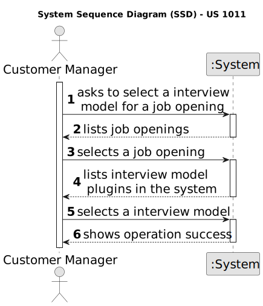

# US 1011

## 1. Context

*This task is being taken for the first time in Sprint B.*

## 2. Requirements

**US 1011** As Customer Manager, I want to select the interview model to use for the interviews of a job opening (for
their evaluation/grading).

**Client Acceptance Criteria:**

**Dependencies/References:**

## 3. Analysis

## 4. Design

For this US, a UI and Controller class have been created. The UI will ask the user to select a jobOpening (with no
Interview Model) and a Plugin (with the INTERVIEW_MODEL type).
With this information, the selected plugin will be then associated with the jobOpening the job opening will then be
persisted in the system.

### 4.1. Sequence Diagram

### 4.2. Class Diagram

### 4.3. Tests

There are no domain classes to make tests for this US