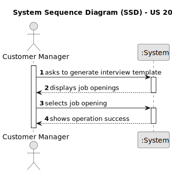
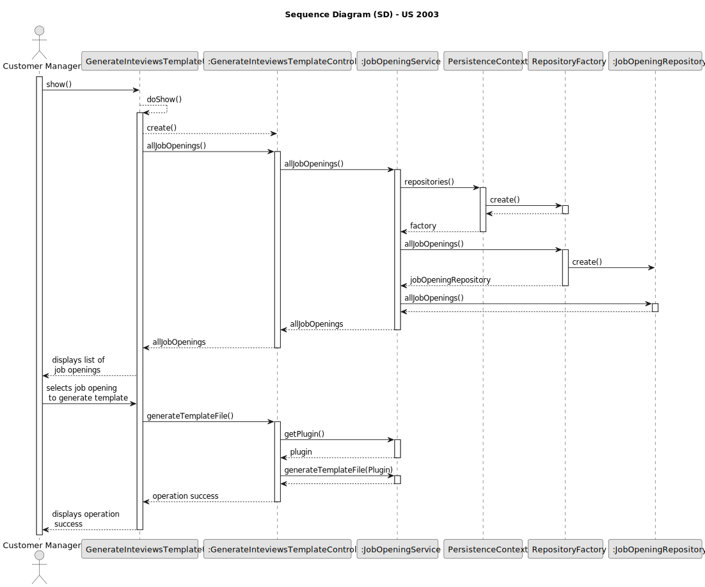

# US 1012

## 1. Context

*This task is being taken for the first time in Sprint B.*

## 2. Requirements

**US 1012** As Customer Manager, I want to generate and export a template text le to help
collect the candidate answers during the interviews.

**Client Acceptance Criteria:**

* Q15: Ricardo – É o Operador que regista uma candidatura ou é o sistema que o faz automaticamente? E como integra o “plugin” de verificação da candidatura neste processo?

* A15: Na US 2002 o Operator regista a candidatura. Para isso, é o Operator que inicia o processo mas o sistema deve importar os dados resultantes do Application File Bot de forma “automática” (Ver References da US 2002). O plugin referido entra neste processo através da US 2003, em que o Operador gera um ficheiro template com os dados a introduzir para validar uma candidatura. Na US 2004, o Operador, após preencher os dados específicos da candidatura (com base no ficheiro template anterior) submete no sistema esse ficheiro que vai ser usado para o sistema avaliar/verificar a candidatura. Se os critérios não forem atingidos a candidatura é recusada.


* Q101: US2003 – Quais são os campos/informação que têm de ser extraídos do candidato para verificar os requisitos de uma job opening?

* A101: Vai depender do que estiver desenhado/especificado no modelo de Requirements Specification usado para esse job opening.


* Q102: Daniela – US2003 – Quem vai preencher as respostas no ficheiro template?

* A102: Será o Operador e, no âmbito da US2004, este submete o ficheiro já preenchido no sistema.


* Q119: Management of screening data - We have a question about the management of the screen phase of the recruitment process. Specifically, after the applications are filtered during the screening process, I'm unsure about who manages the results and oversees this phase. Could you please clarify if the responsibility for managing the screening results falls under the customer manager, the operators, or both?

* A119: In US2003 and US2004 it is the Operator that “downloads” a template file to register the requirements, registers the answers for the requirements in the file, and then uploads the file. It is then the Costumer manager that executes the verification process (US1015) and executes the notification of the results (US1016)


* Q132: US1008 - US2003 - Usage of ANTLR- Is it possible to clarify the usage of ANTRL within user story 2003? You've stated in Q15, Q102 and Q119, that US2003 simply generates the file, while in US2004 the Operator defines the answers and uploads the file. Where is this file uploaded to? Given this, where is the usage of ANTRL in US2003 directed to?

* A132: Regarding the first question, although difficult it is possible to generate the template text file using ANTLR. If so, there we have the usage o ANTLR. Although, unless there is some specific evaluation requirement from LPROG, it is acceptable that the template file is hardcoded in the plugin (no need for any “complex” generation process/function). Regarding the second question, the file is uploaded to the system. The last question was answered first


## 3. Analysis



## 4. Design

### 4.1. Sequence Diagram



### 4.2. Tests

**Refers to Client Acceptance Criteria:** A101

```
   @Test
    public void ensurePlugInEqualsPassesForTheSamePlugin() throws Exception {

        final PlugIn aPlugin = new PluginBuilder().withDesignation(Designation.valueOf("IGUAL")).
                withDescription(Description.valueOf("descrição")).withType(PluginType.INTERVIEW_MODEL)
                .withClass(FQClassName.valueOf("path")).build();

        final PlugIn anotherPlugin = new PluginBuilder().withDesignation(Designation.valueOf("IGUAL")).
                withDescription(Description.valueOf("descrição")).withType(PluginType.INTERVIEW_MODEL)
                .withClass(FQClassName.valueOf("path")).build();


        final boolean expected = aPlugin.equals(anotherPlugin);

        assertTrue(expected);
    }

