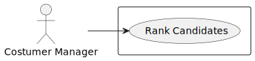
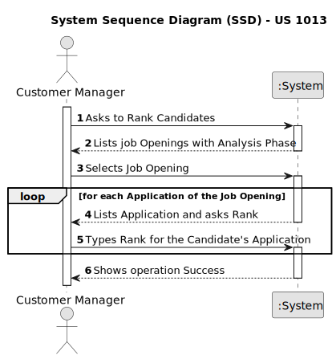
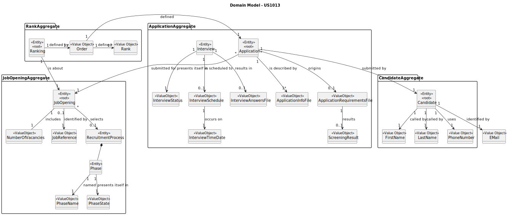
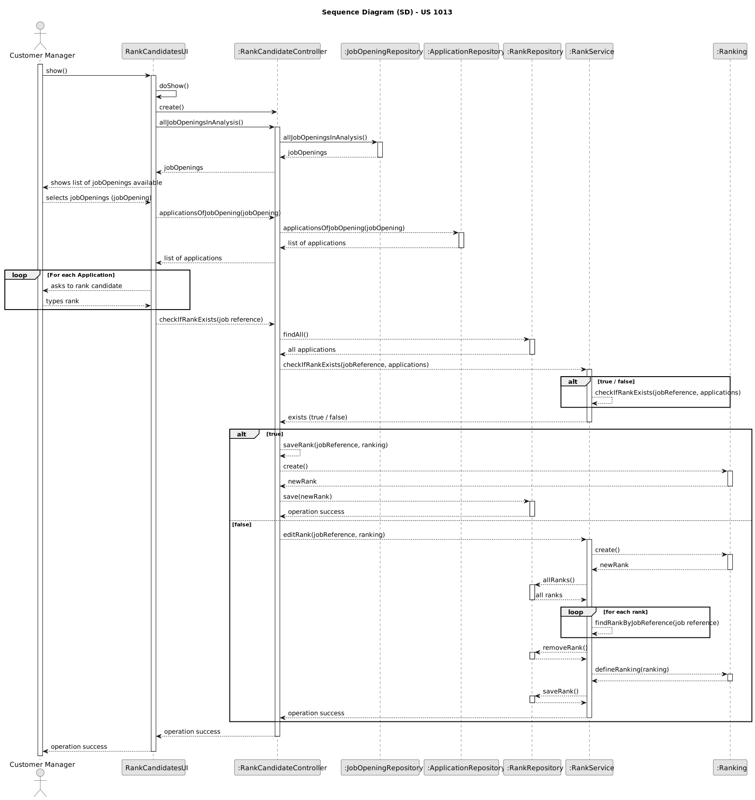

# US 1013

## 1. Context

*This task is being taken for the first time in Sprint C.*

## 2. Requirements

**US 1013** As Customer Manager, I want to rank the candidates for a job opening.

## 2.1. Client Specifications

**Client Acceptance Criteria:**

* Q17 – Relativamente à secção 2.2.1, é na fase de Analysis que as entrevistas são avaliadas e é esse
* resultado que define o ranking dos candidatos? Além disso, para que serve o CV nesta fase? Visto que as entrevistas
* não são obrigatórias, o que acontece quando estas não se realizam

* A17 A pontuação das entrevistas é efetuada/calculada na fase das entrevistas. O CV e outros dados (como o resultado
* das entrevistas) é usado pelo Customer manager na fase de analise para ordenar os candidatos. Mas a ordenação é da
* responsabilidade do Customer Manager (por exemplo, não tem de seguir a ordem da pontuação nas entrevistas). A US
* 1013 corresponde à ordenação manual dos candidatos feita pelo Customer Manager. O facto de não haver entrevistas
* não tem implicações na ordenação dos candidatos pois esta não depende explicitamente das entrevistas.


* Q142 – US1013 - Candidate Ranking – Mr Client mention a manual ranking (Q17). If the pontuation of an
* interview is not essential for the candidate's rank, what criteria is to be used when ranking

* A142 Please view again Q17. The ranking is a decision of the Customer Manager based on all the data that he/she
* may have during the process (including CV and other attached documents and the interviews as well as other
* data/information that may not be part of the system)


* Q148 – US 1013 – A minha questão é relativa a como o ranking é feito. O customer manager dá uma nota a cada
* candidatura e o sistema ordena por ordem crescente sendo assim atribuído o ranking de cada candidatura? Se
* for assim, a nota terá que escala? Caso ainda seja assim ele só pode atribuir uma nota quando tiver conhecimento
* de todas? Ou pode ir colocando e o ranking só é atribuído quando todas as candidaturas já estiverem avaliadas?

* A148 Ver Q17. A ordenação dos candidatos (ranking) é da responsabilidade do customer manager. Ele pode basear-se
* no resultado das entrevistas e de outra informação, mas o ranking não é automático. Não há nota nem escala a usar.
* As candidaturas são ordenadas.


* Q155 – US1013 - Rank Entries - Is there a limit on rank entries? Let's say that 100 candidates apply for a
* job opening. Does the Customer Manager have to sort all 100 candidates?

* A155 The order of candidates should include at least all the first candidates within the vacancy number and some
* following candidates. At the moment, I do not know exactly the number of the following candidates to be ordered.
* Therefore, I would like for it to be a global configuration property in the system. It could be a number
* representing a magnitude from the vacancy number. For instance, 1 could mean exactly the same number of
* vacancies, 2 the double, 0,5 half the number of vacancies. The remainder of the candidates could be just
* tagged as not ranked.


* Q158 – US1013 - Process of ranking - How is the ranking done? The customer manager selects a job opening and is
* shown the different candidates, and they assign a rank to each one. And the ranking process end when he assigns
* a rank to all candidates? Example: - Rank the candidate1: - Write the rank: 3 - Rank the candidate2: - Write the
* rank: 1 - Rank the candidate3: - Write the rank: 4

* A158 See Q155. Once again, I do not have specific requirements for UI/UX. But I can provide some ideas. Being a
* console application limits the UI/UX. However, I see this functionality similar to the way people enter recipients
* for an email, for instance. In the case of the recipients of an email I simply write their emails separated by a
* comma. Could it be similar in this case?


* Q159 – US1013 - Stop the ranking process - When a customer manager starts the ranking process, he can stop and
* continue later? Or the ranking process must be done in one go

* A159 See Q158. I guess it may depend on how you implement the solution. But, in the case it may work as a “long
* operation” be aware of when and how to conclude the “operation”


* Q160 – US1013 - Edit ranking - The customer manager can change the rank of a candidate after assigning it?

* A160 See Q159. That should be possible if none of the interested parties were yet notified of the results.


* Q162 – US1013 - When the analysis phase ends, the ranking need to have all the candidates? or can the customer
* manager rank only some of the candidates?

* A162 All the candidates should be ranked before moving to the result phase


* Q163 – US1013 - When the customer manager is ranking the candidates, in terms of UI, should we display
* information from the application such as interview score, etc... or just the candidate's name and email?

* A163 As stated before, I do not have specific requirements for the UI/UX. Use best practices. However, I would
* like it to be possible for the Customer Manager to have 2 or more instances of the application running, so that
* he/she could, for instance, see the interviews grades and, at the same time, register the order/ranking of the
* candidates.


* Q165 – US1013 Clarifications - Mr. Client mentioned in Q155 that the system should have ranking configurations so
* that the Customer Manager doesn't have to rank all the candidates for a job opening, and that the ones that haven't
* been manually ranked are to be tagged with "not ranked". However, in Q162, you've said that all the candidates must
* be ranked before the result phase starts. Can you clarify this situation

* A165 The customer manager must evaluate all the candidates. It is the only way he/she can produce a ranking/order
* for the candidates and select the “best” candidates to be included in the vacancies for the job opening. In Q155
* I was only proposing a way to avoid recording in the system a lot of details that will not have any impact on the
* next activities. The term “not ranked” maybe is not the best. Maybe “rank not recorded” or something similar could
* be more appropriated


* QQ192 – US1013 – Global Configurations – I'm struggling to understang the global configurations defined for US1013.
* All candidates must be ranked, so that all of them can be notified. Are the global configurations only for persistence
* purposes? Example: all candidates are ranked and notified, so if 0.5 is in the global definition, then only half of
  the
* number of vacancies must be persisted in the system. Is this the scenario that Mr. Client has in mind?

A192. I am assuming you refer to Q155. Suppose you have 2 vacancies. You have 80 candidates. If you configure the
property
as 1 you need to rank (record in the system) the 2 first candidates plus 2 other candidates. If the property is 0,5 you
should rank the 2 first candidates plus 1 third candidate. If the property is 2, you should rank the 2 first candidates
plus 4 extra candidates. This is a way to assure that you do not have to record in the system the rank of all the
possible
candidates, but only a number that includes the ones required to fulfill the vacancies plus some extra (according to the
property) for possible exceptions (such as someone leaving the application). But my suggestion was only to help in the
UI/UX.
You may use any other option

Q215 – US1013 – About the Us1013 which states: "As Customer Manager, I want to rank the candidates for a job opening.".
I want to know if two candidates can be tied, which would mean having the same rank for the same job opening

* A215. No, ties should not be allowed. It must be clear what candidates are selected to the vacancies.

## 2.2. Acceptance Criteria

* The Job Openings listed must be the only ones active during the analysis phase

* Applications, of the Job Opening specified, are to be ranked

## 3. Analysis

### 3.1 Use Case Diagram



### 3.2 System Sequence Diagram



### 3.3 Domain Model



## 4. Design

For the implementation of this US all jobOpenings with a recruitment process and on the Analysis phase will be listed to
the Customer Manager.
The Customer Manager will select one and all valid applications will be shown and the Customer Manager will be asked
to rank them.
After that, the ranking will be saved(or edited if already exists) and the operation success will be presented

### 4.1. Sequence Diagram



### 4.2. Tests

* Tests for Ranking Class
```
    @Test
    public void createRankingWithNullJobReference() {
        boolean check;
        List<Order1> list = new ArrayList<>();

        try {
            list.add(o1);
            final Ranking ranking1 = new Ranking(null, list);
            check = true;
        } catch (IllegalArgumentException e) {
            check = false;
        }
        assertFalse(check);
    }


    @Test
    public void createRankingWithNullRanking() {
        boolean check;

        try {
            final Ranking ranking1 = new Ranking(jobReference1, null);
            check = true;
        } catch (IllegalArgumentException e) {
            check = false;
        }
        assertFalse(check);
    }


    @Test
    public void createValidRanking1() {
        boolean check;
        List<Order1> list = new ArrayList<>();

        try {
            list.add(o2);
            list.add(o1);
            list.add(o3);
            final Ranking ranking1 = new Ranking(jobReference1, list);
            check = true;
        } catch (IllegalArgumentException e) {
            check = false;
        }
        assertTrue(check);
    }


    @Test
    public void createValidRanking2() {
        boolean check;
        List<Order1> list = new ArrayList<>();

        try {
            list.add(o2);
            list.add(o1);
            list.add(o3);
            list.add(o4);
            final Ranking ranking1 = new Ranking(jobReference1, list);
            check = true;
        } catch (IllegalArgumentException e) {
            check = false;
        }
        assertTrue(check);
    }

    @Test
    public void createValidRanking3() {
        boolean check;
        List<Order1> list = new ArrayList<>();

        try {
            list.add(o2);
            final Ranking ranking1 = new Ranking(jobReference1, list);
            check = true;
        } catch (IllegalArgumentException e) {
            check = false;
        }
        assertTrue(check);
    }

    @Test
    public void createRankingWithEmptyList() {
        boolean check;
        List<Order1> list = new ArrayList<>();

        try {
            final Ranking ranking1 = new Ranking(jobReference1, list);
            check = true;
        } catch (IllegalArgumentException e) {
            check = false;
        }
        assertFalse(check);
    }


````

* Tests for Order1 Class

````
    @Test
    public void withNullRank() {
        boolean check;
        try {
            Order1 o1 = new Order1(application, null);
            check = true;
        } catch (Exception e) {
            check = false;
        }
        assertFalse(check);
    }

    @Test
    public void withNullApplication() {
        boolean check;
        try {
            Order1 o1 = new Order1(null, r1);
            check = true;
        } catch (IllegalArgumentException e) {
            check = false;
        }
        assertFalse(check);
    }

    @Test
    public void testEqualsWithSameOrder() {
        final boolean check = o1.equals(o1);
        assertTrue(check);
    }
    
    @Test
    public void testEqualsWithDifferentOrder() {
        final boolean check = o1.equals(o2);

        assertFalse(check);
    }

    @Test
    public void validTest() {
        boolean check;
        try {
            Order1 order = new Order1(application, r1);
            check = true;
        } catch (IllegalArgumentException e) {
            check = false;
        }
        assertTrue(check);
    }


    @Test
    public void validTest2() {
        boolean check;
        try {
            Order1 order = new Order1(application, r2);
            check = true;
        } catch (IllegalArgumentException e) {
            check = false;
        }
        assertTrue(check);
    }

````

* Tests for Rank Class

````
    @Test
    public void testWithNullRank() {
        boolean check = true;
        try {
            Rank r = new Rank(null);
        } catch (IllegalArgumentException e) {
            check = false;
        }
        assertFalse(check);
    }

    @Test
    public void testNegativeRank() {
        boolean check = true;
        try {
            Rank r = new Rank(-10);
        } catch (IllegalArgumentException e) {
            check = false;
        }
        assertFalse(check);
    }

    @Test
    public void testRankZero() {
        boolean check = true;
        try {
            Rank r = new Rank(0);
        } catch (IllegalArgumentException e) {
            check = false;
        }
        assertFalse(check);
    }


    @Test
    public void validTest1() {
        boolean check = true;
        try {
            Rank r = new Rank(2);
        } catch (IllegalArgumentException e) {
            check = false;
        }
        assert (check);
    }

    @Test
    public void validTest2() {
        boolean check = true;
        try {
            Rank r = new Rank(12);
        } catch (IllegalArgumentException e) {
            check = false;
        }
        assert (check);
    }

    @Test
    public void validTest3() {
        boolean check = true;
        try {
            Rank r = new Rank(9);
        } catch (IllegalArgumentException e) {
            check = false;
        }
        assert (check);
    }

    @Test
    public void testEqualsWithDifferentNumber() {
        final boolean expected = r1.equals(r2);

        assertFalse(expected);
    }

    @Test
    public void testEqualsWithSameNumber() {
        final boolean expected = r1.equals(r1);

        assertTrue(expected);
    }
````