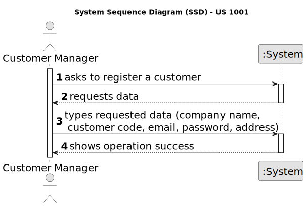

# US 1001

## 1. Context

*This task is being taken for the first time in Sprint C.*

## 2. Requirements

**US 1014** As Customer Manager, I want to record the time and date for an interview with a
candidate

**Client Acceptance Criteria:**

## 3. Analysis



## 4. Design


### 4.1. Sequence Diagram


### 4.3. Tests

```

````