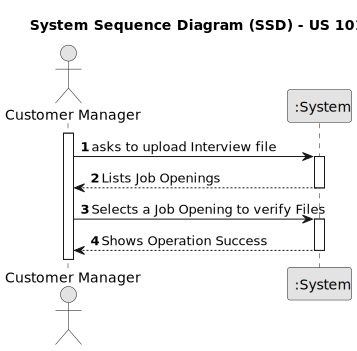
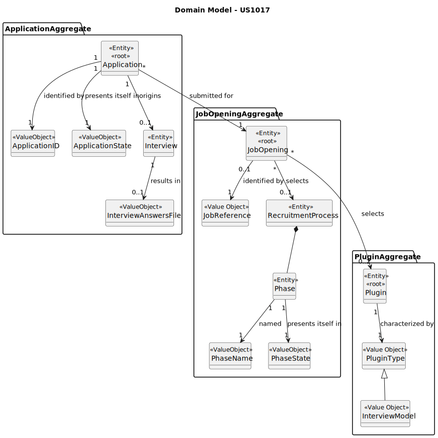
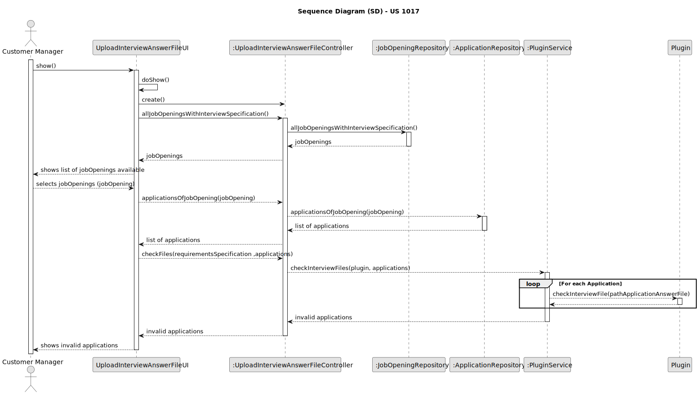

# US 1017

## 1. Context

*This task is being taken for the first time in Sprint C.*

## 2. Requirements

**US 1017** As Customer Manager, I want to upload a text file with the candidate responses for an interview.

**Client Acceptance Criteria:**

* Q214 Pedro – US1017/1018 – O nosso grupo tem uma dúvida em relação ao processamento dos ficheiros de respostas dos
  candidatos para a entrevista. No caso de upload de um ficheiro, se a pergunta que requer um número como resposta for
  preenchida com um formato inválido, por exemplo, uma letra, devemos considerar isso como um formato inválido na US
  1017 (e pedir para o user voltar a dar upload a um ficheiro válido) ou devemos, na US1018, considerar que está
  incorreta e atribuir 0 pontos automaticamente para essa resposta inválida? Isto é, na US 1017, devemos apenas
  verificar o formato do ficheiro ou devemos verificar também se as respostas são preenchidas com o tipo de dados
  correto?

* A214. O caso mencionado deve ser considerado um erro de validação do ficheiro (ou seja, o ficheiro submetido não
corresponde à gramática definida).

* Q227 Bruno Fernandes – US 1017 - Em termos "upload" certamente passa pela verificação com a gramática e após sucesso colocar o ficheiro das respostas da entrevista junto da pasta com os ficheiros da "Application" certo?

* A227. Sim, a sintaxe deve ser verificada e, se tudo estiver correto, o ficheiro deve ser “importado” para o sistema de forma a que possa ser usado posteriormente, por exemplo, no âmbito da US 1018. Qual a solução para o “importar” faz parte da vossa solução. Idealmente julgo que faria sentido que ficasse integrado na base de dados. Não sendo possível, penso que é aceitável que fique numa pasta/diretório de um servidor.

## 2.2. Acceptance Criteria

* Files must be updated with the answers

## 3. Analysis

### 3.1 Use Case Diagram

### 3.2 System Sequence Diagram

### 3.3 Domain Model

## 4. Design

For the implementation of this US all jobOpenings with a recruitment process will be listed to the Customer Manager.
After that, the Customer Manager will select one and all the answered files will be updated and its path will be
presented,
so he can check them out.

### 4.1. Sequence Diagram

