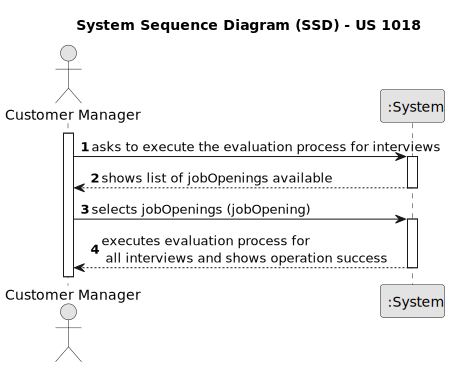
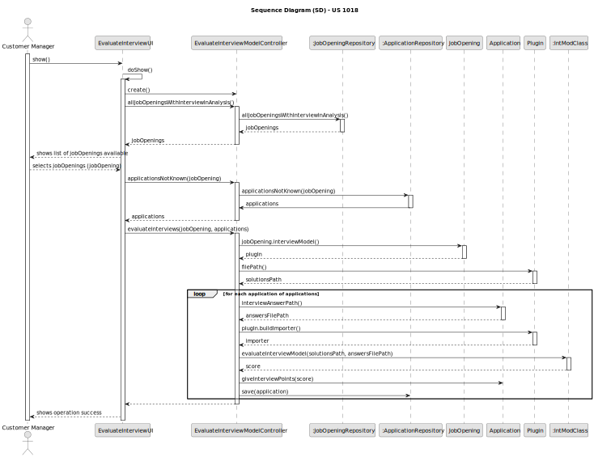

# US 1018

## 1. Context

*This task is being taken for the first time in Sprint C.*

## 2. Requirements

**US 1018** As Customer Manager, I want to execute the process that evaluates (grades) the
interviews for a job opening.

**Client Acceptance Criteria:**

Q199: US1018 – Relativamente à US1018, após a execução do processo de avalição de todas as entrevistas da job opening, a
fase em que esta se encontra deve ser automaticamente mudado para "Result" ou deve ser mantida em "Analysis" e apenas
pode ser mudada pela execução da US1010?

A199: A US1018 não deve alterar a fase actual. A US1010 permite fazer a mudança de fases do processo de recrutamento.

Q214: US1017/1018 – O nosso grupo tem uma dúvida em relação ao processamento dos ficheiros de respostas dos candidatos
para a entrevista. No caso de upload de um ficheiro, se a pergunta que requer um número como resposta for preenchida com
um formato inválido, por exemplo, uma letra, devemos considerar isso como um formato inválido na US 1017 (e pedir para o
user voltar a dar upload a um ficheiro válido) ou devemos, na US1018, considerar que está incorreta e atribuir 0 pontos
automaticamente para essa resposta inválida? Isto é, na US 1017, devemos apenas verificar o formato do ficheiro ou
devemos verificar também se as respostas são preenchidas com o tipo de dados correto?

A214: O caso mencionado deve ser considerado um erro de validação do ficheiro (ou seja, o ficheiro submetido não
corresponde à gramática definida).

**NON FUNCTIONAL REQUIREMENTS:**

NFR09(LPROG) - Requirement Specifications and Interview Models The support
for this functionality must follow specific technical requirements, specified in LPROG.
The ANTLR tool should be used (https://www.antlr.org/).

## 3. Analysis

## 4. Design

For the implementation of this US all jobOpenings with a recruitment process and on the Analysis phase will be listed to
the Customer Manager.
The Customer Manager will select one and all valid applications with a InterviewAnswerPath will be saved in a list.
For all applications in this list the process of evaluation will be executed and a score will be generated, being later
attributed to its corresponding application.
Finally the applications with the score will now be saved in the system.

### 4.1. Sequence Diagram

