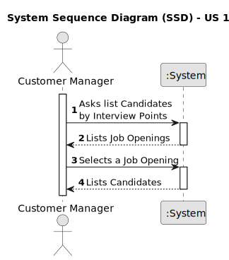

# US 1019

## 1. Context

*This task is being taken for the first time in Sprint C.*

## 2. Requirements

**US 1019** As Customer Manager, I want to get an ordered list of candidates, using the job
interview points (grades), to help me analyze the candidates.

**Client Acceptance Criteria:**

* Q169 – US1019 - Relativamente a esta user story, "US 1019 - As Customer Manager, I want to get an ordered list of candidates,
* using the job interview points (grades), to help me analyze the candidates.", a lista que pretende é relacionada a uma job 
* opening correto? A maneira de ordenação é ascendente ou quer uma opção que inclua ascendente e descendente?

* A169 Sim, a ordenação é relativa a candidaturas para um job opening. A ordenação deve ser descendente, do que tem maior 
* pontuação para o que tem menor pontuação.

## 2.2. Acceptance Criteria

* The Job Openings listed must be the only that have a Recruitment Process that has an InterviewModel associated

* The Candidates will be listed by descending order


## 3. Analysis

### 3.1 Use Case Diagram


### 3.2 System Sequence Diagram



### 3.3 Domain Model


## 4. Design

For the implementation of this US all jobOpenings with a recruitment process and with an ApplicationInterview
and on the Analysis phase will be listed to the Customer Manager.
After that, the Customer Manager will select one and all the Candidates of that jobOpening will be presented in
descending order of interviewPoints.

### 4.1. Sequence Diagram


### 4.2. Tests

```

````