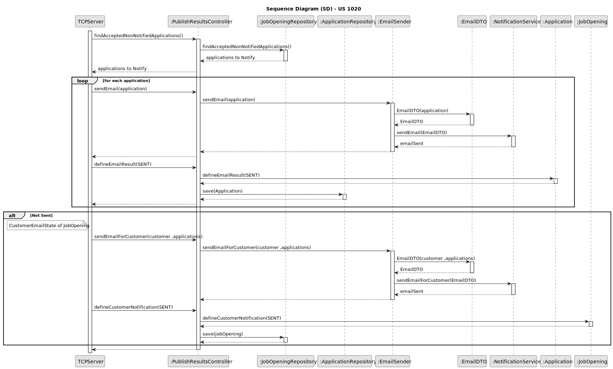

# US 1020

## 1. Context

*This task is being taken for the first time in Sprint C.*

## 2. Requirements

**US 1020** As Customer Manager, I want to publish the results of the selection of candidates
for a job opening, so that candidates and customer are notified by email of the result.

**Client Acceptance Criteria:**

* Q48 Beatriz – US1016 e US1020, relativamente ao envio das notificações por email, é necessário guardar que esse envio
  foi feito?

* A48. No documento nada de explicito é dito sobre este assunto. No entanto, do ponto de vista de gestão do processo da
  jobs4u
* parece-me adequado que essa informação fique registada.

* Q51 – US 1020, qual é o formato para essa publicação?

* A51. A publicação refere-se a informar os candidatos e o cliente, por email. Os candidatos que são selecionados devem
  receber um
* email a indicar que para a sua candidatura ao job opening foram selecionados e irão ser contactados pela empresa. No
  que se refere
* à empresa, esta deve receber um email com a lista dos candidatos selecionados que deve incluir o nome e dados de
  contacto do
* candidato

* Q190 Barbosa – US1020 – Regarding the selection of candidates, should we assume that the first N candidates in the
  ranking
* (where N is the number of job vacancies) are chosen, or should we allow the customer manager to select the N
  candidates?

* A190. The first option (using the results from US1013).

## 2.2. Acceptance Criteria

* Every Candidate should be notified of the result as well as the Customer of the Job Opening

* The Candidates to be notified are the ones Ranked

## 3. Analysis

### 3.1 Use Case Diagram

### 3.2 System Sequence Diagram

### 3.3 Domain Model

## 4. Design

For the implementation of this US all jobOpenings with a recruitment process and on the Results phase will be listed
to the Customer Manager.
After that, the Customer Manager will select one, the candidates and the customer to be notified will be shown and
finally he will be asked to confirm that he wants to notify the Users in related to this operation.
After all, the candidates will receive, via email, the notification congratulation them for being accepted, as well as
costumer, that is going to receive an email with all the candidates accepted for the jobOpening previous selected.

### 4.1. Sequence Diagram

* Sequence Diagram For the TCP Server 

