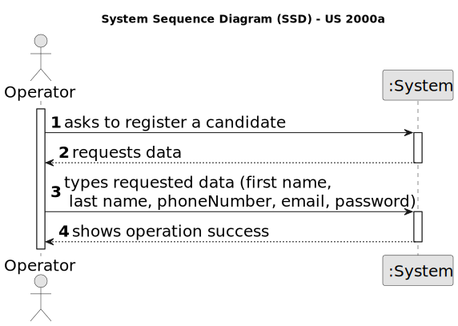
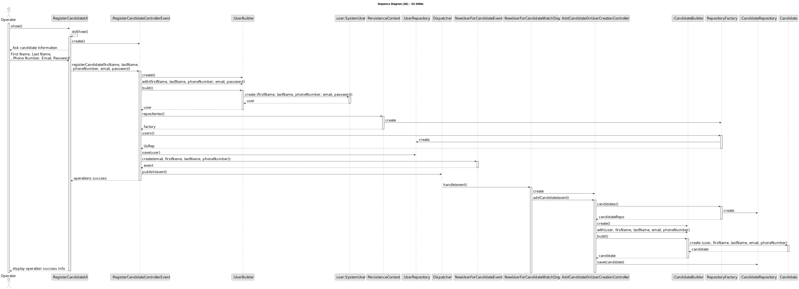

# US 2000a

## 1. Context

*This task is being taken for the first time in Sprint B.*

## 2. Requirements

**US 2000a** As Operator, I want to register a candidate and create a corresponding user

**Client Acceptance Criteria:**

* Q11: No enunciado não está explicita a informação a recolher para os Customers? Qual a informação necessária? E quando
  aos funcionários da empresa?

* A11: De facto isso não está explicito. No entanto, são referidos no nome da empresa e o seu endereço no âmbito de um
  job opening.
  Quanto aos utilizadores (representante da empresa que acede à Customer App) eu diria que serão dados similares ao do
  Candidate.
  Quando aos funcionários da empresa, eu diria que é importante garantir que é usado o email para identificar qualquer
  utilizador
  do sistema. Penso que será importante para cada utilizador termos o nome completo assim como um short user name (que
  deverá ser
  único). Actualização em 2024-03-21: O Product Owner reconsiderou e decidiu que o short user name é dispensável uma vez
  que para
  autenticação dos utilizadores se deve usar apenas o email e a password.


* Q19: Na criação de um utilizador no sistema o nome é definido pelo utilizador ou é o nome da pessoa (primeiro e
  último) e
  se a password é definida pelo utilizador ou gerada pelo sistema?

* A19:  No âmbito da US 2000a o Operator cria utilizadores do sistema para candidatos que ainda não estejam no sistema.
  Tem de fazer
  isso com base nos dados recebidos na candidatura (que incluem email e nome). O email servirá para identificar a
  pessoa. Neste
  contexto é necessário ter uma password para esse novo utilizador. Uma vez que essa informação não é transmitida pelo
  candidato,
  suponho que a solução mais “aconselhada” será o sistema gerar uma password para esse utilizador. Como o
  utilizador/candidato irá
  receber essa informação (a forma de autenticação na app) está out of scope, no sentido em que não existe nenhuma US
  que remete
  para isso. As US 1000 e 1001 também remetem para criação de utilizadores. Aqui, eventualmente poderia-se pensar em
  introduzir
  manualmente as passwords, mas pode ser pelo mesmo mecanismo de definição automática de password, descrito
  anteriormente.
  Relativamente ao nome ver novamente a Q11


* Q33: O candidato tem um código identificativo ou é o email que o identifica?

* A33: A identificação do candidato é por email. Não haverá necessidade de um código


* Q43: Daniela – Para os candidato e para os utilizadores do sistema que informações são necessárias?

* A43: Alguma informação anterior é referida na Q11. Para além disso a secção 2.2.3 refere que relativamente aos
  candidatos temos
* a seguinte informação: email of the candidate, name of the candidate, phone number of the candidate.


* Q74: US2000a – Relativamente ao registo dos candidatos, os dados devem ser inseridos manualmente ou importados do
  ficheiro
  com os dados do candidato?

* A74: Faz sentido que sejam importados do ficheiro, no âmbito da US2002. Eventualmente dar a possibilidade do
  utilizador fazer
  alterações, caso seja necessário. A US2000a refere-se a uma funcionalidade do Operador, manualmente, registar
  candidatos.
  (Nota: resposta actualizada em 2024/04/18, a negrito)

## 3. Analysis



## 4. Design

### 4.1. Sequence Diagram



### 4.2. Tests

**Refers to Client Acceptance Criteria:** A43

```
    @Test
    public void testEqualsWithDifferentNumber(){
        final boolean expected = phoneNumber1.equals(phoneNumber2);

        assertFalse(expected);
    }

    @Test
    public void testEqualsWithSameNumber(){
        final boolean expected = phoneNumber1.equals(phoneNumber1);

        assertTrue(expected);
    }

    @Test
    public void testNullPhoneNumber(){
        boolean check = true;
        try {
            PhoneNumber number = new PhoneNumber(null);
        } catch (IllegalArgumentException e) {
            check = false;
        }
        assertFalse(check);
    }

    @Test
    public void testBlankPhoneNumber(){
        boolean check = true;
        try {
            PhoneNumber number = new PhoneNumber("");
        } catch (IllegalArgumentException e) {
            check = false;
        }
        assertFalse(check);
    }

    @Test
    public void testInvalidPhoneNumber(){
        boolean check = true;
        try {
            PhoneNumber number = new PhoneNumber("1234");
        } catch (IllegalArgumentException e) {
            check = false;
        }
        assertFalse(check);
    }

    @Test
    public void testInvalidPhoneNumber2(){
        boolean check = true;
        try {
            PhoneNumber number = new PhoneNumber("1234456789101112");
        } catch (IllegalArgumentException e) {
            check = false;
        }
        assertFalse(check);
    }

    @Test
    public void testValidPhoneNumber(){
        boolean check = true;
        try {
            PhoneNumber number = new PhoneNumber("999888777");
        } catch (IllegalArgumentException e) {
            check = false;
        }
        assertTrue(check);
    }

    @Test
    public void testValidPhoneNumber2(){
        boolean check = true;
        try {
            PhoneNumber number = new PhoneNumber("111222333");
        } catch (IllegalArgumentException e) {
            check = false;
        }
        assertTrue(check);
    }

@Test
    public void createCandidateWithNullPhoneNumber() throws Exception {
        boolean check = true;
        try {
            Candidate candidate = new CandidateBuilder().withCandidateFirstName("name").withCandidateLastName
                    ("name").withSystemUser(getNewCandidateUser()).withPhoneNumber(null).withEmailAddress
                    (email1).build();

        } catch (IllegalArgumentException e) {
            check = false;
        }
        assertFalse(check);
    }

    @Test
    public void createCandidateWithInvalidPhoneNumber() throws Exception {
        boolean check = true;
        try {
            Candidate candidate = new CandidateBuilder().withCandidateFirstName("name").withCandidateLastName
                    ("name").withSystemUser(getNewCandidateUser()).withPhoneNumber("123").withEmailAddress
                    (email1).build();

        } catch (IllegalArgumentException e) {
            check = false;
        }
        assertFalse(check);
    }

```
**Refers to Client Acceptance Criteria:** A11

```
@Test
    public void ensureCandidateEqualsPassesForTheSameEmail() throws Exception {
        final Candidate candidate = new CandidateBuilder().withCandidateFirstName("name").withCandidateLastName
                ("name").withSystemUser(getNewCandidateUser()).withPhoneNumber("123123123").withEmailAddress
                (email1).build();

        final Candidate candidate1 = new CandidateBuilder().withCandidateFirstName("name").withCandidateLastName
                ("name").withSystemUser(getNewCandidateUser()).withPhoneNumber("123123123").withEmailAddress
                (email1).build();

        final boolean expected = candidate.equals(candidate1);

        assertTrue(expected);
    }

    @Test
    public void ensureCandidateEqualsPassesForDifferentSameEmail() throws Exception {
        final Candidate candidate = new CandidateBuilder().withCandidateFirstName("name").withCandidateLastName
                ("name").withSystemUser(getNewCandidateUser()).withPhoneNumber("123123123").withEmailAddress
                (email1).build();

        final Candidate candidate1 = new CandidateBuilder().withCandidateFirstName("name").withCandidateLastName
                ("name").withSystemUser(getNewCandidateUser()).withPhoneNumber("123123123").withEmailAddress
                (email2).build();

        final boolean expected = candidate.equals(candidate1);

        assertFalse(expected);
    }

    @Test
    public void ensureCandidateUserEqualsFailsForDifferentObjectTypes() throws Exception {
        final Candidate candidate = new CandidateBuilder().withCandidateFirstName("name").withCandidateLastName
                ("name").withSystemUser(getNewCandidateUser()).withPhoneNumber("123123123").withEmailAddress
                (email1).build();

        @SuppressWarnings("unlikely-arg-type") final boolean expected = candidate.equals(getNewCandidateUser());

        assertFalse(expected);
    }

    @Test
    public void ensureTwoCandidateUserWithDifferentEmailsAreNotTheSame() throws Exception {
        final Candidate candidate = new CandidateBuilder().withCandidateFirstName("name").withCandidateLastName
                ("name").withSystemUser(getNewCandidateUser()).withPhoneNumber("123123123").withEmailAddress
                (email1).build();

        final Candidate candidate1 =new CandidateBuilder().withCandidateFirstName("name").withCandidateLastName
                ("name").withSystemUser(getNewCandidateUser()).withPhoneNumber("123123123").withEmailAddress
                (email2).build();

        final boolean expected = candidate.sameAs(candidate1);

        assertFalse(expected);
    }
```
