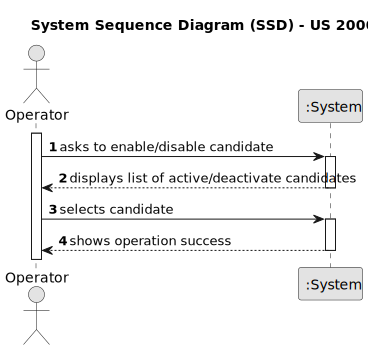
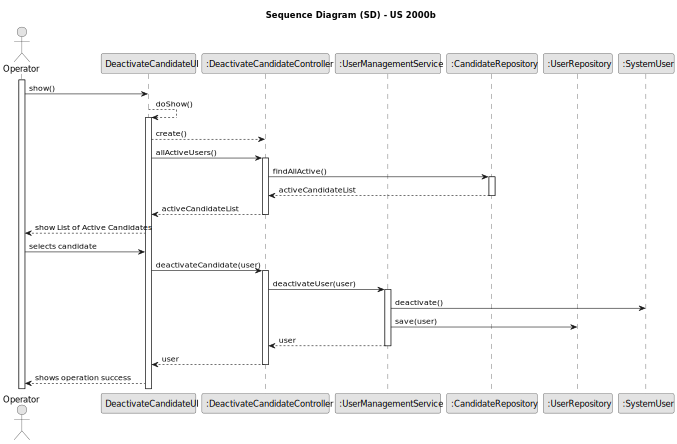
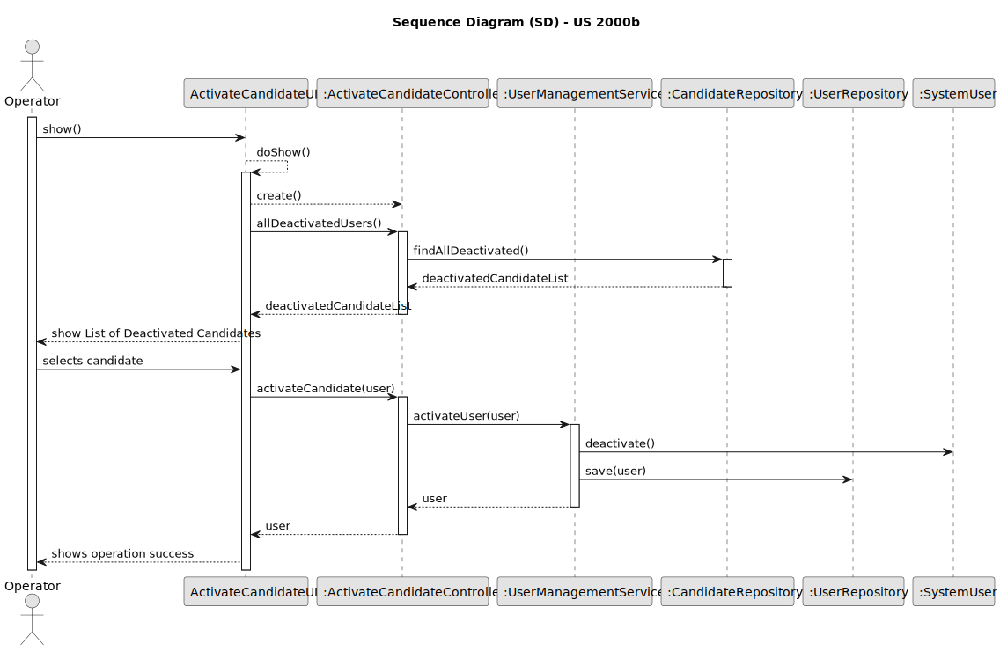

# US 2000b

## 1. Context

*This task is being taken for the first time in Sprint C.*

## 2. Requirements

**US 2000b** As Operator, I want to enable/disable a candidate

**Client Acceptance Criteria:**

Q30: US2000b, o que é o enable/disable do candidato?

A30: (alguma referencia a Q23). Refere-se a desativar o acesso do candidato ao sistema (i.e., Candidate App)

Q146: US 2000b – for the use case 2000b which states "As Operator, I want to enable/disable a candidate". I would like
to know if the client would like two different menus to be created, with each menu responsible for either activating or
deactivating candidates.

A146: I have no specific requirements for the UX/UI but I want you to follow best practices.

Q213: US2000b – Na us 2000b, é suposto ao desativar um candidato, apenas lhe retirar a role e deixa-lo como
user ao desativa-lo completamente?

A213: Ver Q30. Considero que o objetivo desta US é permitir bloquear e desbloquear o acesso de um candidato ao sistema.
Isso não deve invalidar as candidaturas dessa pessoa, apenas o acesso desse candidato ao sistema.

## 3. Analysis

## 4. Design

For the implementation of this US, two options were created in the Operator menu which will show a list of candidates
The candidates will be shown depending on the state of their users (active or deactive) and after one is selected, its
user will be active/deactive.
In case of it being deactive, the Candidate Application will not detect the user, as if it does not exist.
Major parts of this US were reused from US 1000.

### 4.1. Sequence Diagram

