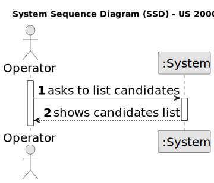
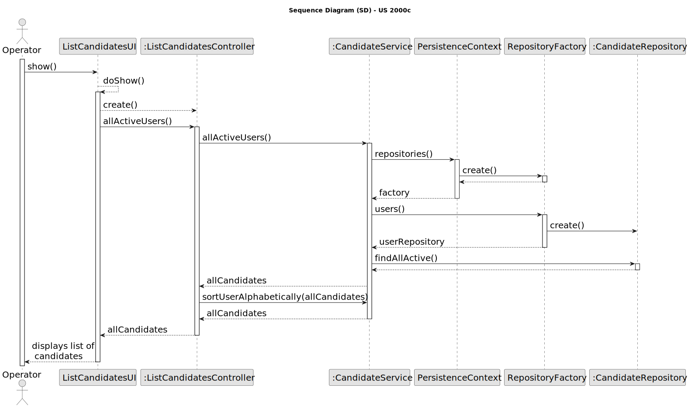

# US 2000c

## 1. Context

*This task is being taken for the first time in Sprint B.*

## 2. Requirements

**US 2000c** As Operator, I want to list all candidates

**Client Acceptance Criteria:**

* Q42: US1006, Qual a informação do nome do candidato deve aparecer (nome completo, primeiro e ultimo nome , etc)?

* A42: À partida diria que seria o nome, tal como foi recebido na application que fez (página 6, “name of the candidate”


* Q58: US 2000c, quando estiver a listar os candidatos basta listar os emails?

* A58: Eu diria que faz sentido apresentar para cada candidato o seu email e o seu nome.


* Q66: US2000c - Ordem dos candidatos. Na US 2000c é pedido que implementemos a função de listar todos os candidatos.
* É necessário ordenar os candidatos (por exemplo por ordem alfabética do nome)? Se for, qual é o critério que devemos
* seguir?

* A66: Sim a listagem pode ser por ordem alfabética do nome.


Q60 Alejandro – Na US 2000c, existem politicas de negócio em relação a listar os candidatos?

A60. Devem seguir eventuais condicionante relativas ao possível estado do candidato


## 3. Analysis



## 4. Design

### 4.1. Sequence Diagram



### 4.2. Tests

**Refers to Client Acceptance Criteria:** A42

```
    @Test
    public void createCandidateWithNullFirstName() throws Exception {
        boolean check = true;
        try {
            Candidate candidate = new CandidateBuilder().withCandidateFirstName(null).withCandidateLastName
                    ("name").withSystemUser(getNewCandidateUser()).withPhoneNumber("123123123").withEmailAddress
                    (email1).build();

        } catch (IllegalArgumentException e) {
            check = false;
        }
        assertFalse(check);
    }

    @Test
    public void createCandidateWithNullLastName() throws Exception {
        boolean check = true;
        try {
            Candidate candidate = new CandidateBuilder().withCandidateFirstName("name").withCandidateLastName
                    (null).withSystemUser(getNewCandidateUser()).withPhoneNumber("123123123").withEmailAddress
                    (email1).build();

        } catch (IllegalArgumentException e) {
            check = false;
        }
        assertFalse(check);
    }
```