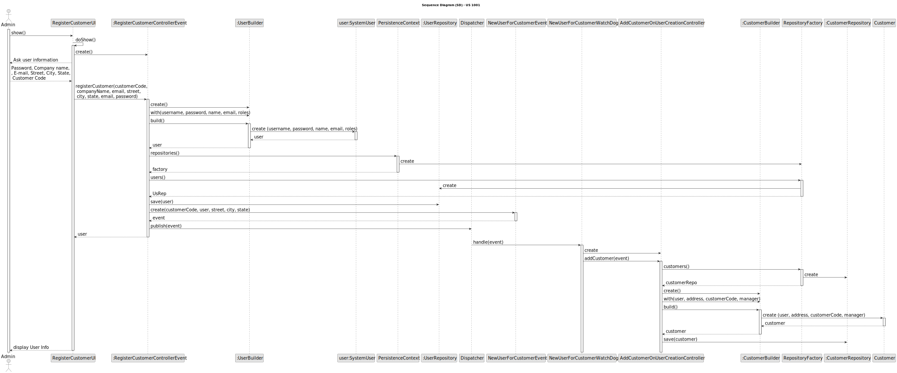

# US 1001

## 1. Context

*This task is being taken for the first time in Sprint C.*

## 2. Requirements

**US 2001b** As Product Owner, I want the system to, continuously, process the les produced
by the Applications Email Bot, so that they can be imported into the system by initiative
of the Operator

**Client Acceptance Criteria:**

## 3. Analysis


## 4. Design


### 4.1. Sequence Diagram



### 4.3. Tests

```

````