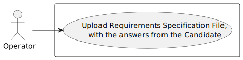
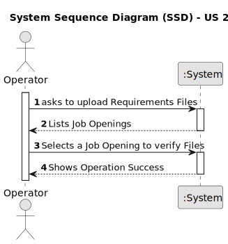
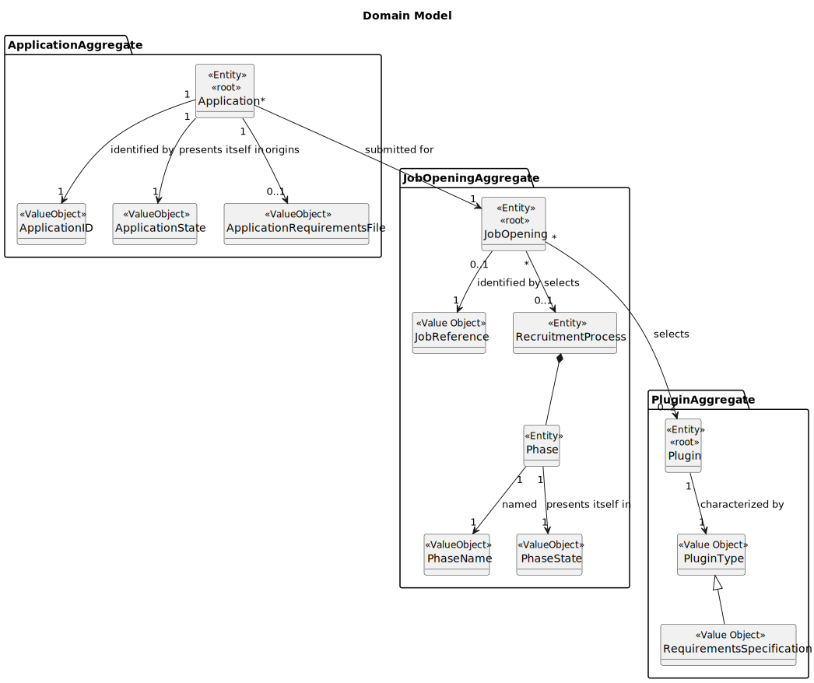
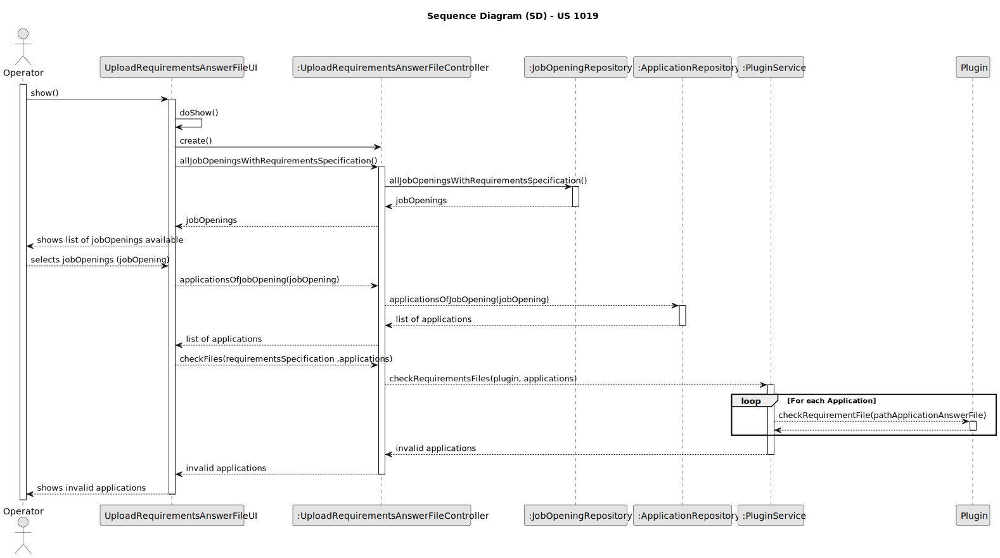

# US 2004

## 1. Context

*This task is being taken for the first time in Sprint C.*

## 2. Requirements

**US 2004** As Operator, I want to upload a text file with the data elds (requirements ) of a
candidate for its verification.

**Client Acceptance Criteria:**

* Q15 – É o Operador que regista uma candidatura ou é o sistema que o faz automaticamente? E como integra o “plugin” de
* verificação da candidatura neste processo?

* A15 Na US 2002 o Operator regista a candidatura. Para isso, é o Operator que inicia o processo mas o sistema deve
  importar os
* dados resultantes do Application File Bot de forma “automática” (Ver References da US 2002). O plugin referido entra
  neste
* processo através da US 2003, em que o Operador gera um ficheiro template com os dados a introduzir para validar uma
  candidatura.
* Na US 2004, o Operador, após preencher os dados específicos da candidatura (com base no ficheiro template anterior)
  submete no
* sistema esse ficheiro que vai ser usado para o sistema avaliar/verificar a candidatura. Se os critérios não forem
  atingidos a
* candidatura é recusada.

* Q102 – US2003 – Quem vai preencher as respostas no ficheiro template?

* A102 Será o Operador e, no âmbito da US2004, este submete o ficheiro já preenchido no sistema.

* Q119 – Management of screening data - We have a question about the management of the screen phase of the recruitment
  process.
* Specifically, after the applications are filtered during the screening process, I'm unsure about who manages the
  results and
* oversees this phase. Could you please clarify if the responsibility for managing the screening results falls under the
  customer
* manager, the operators, or both

* A119. In US2003 and US2004 it is the Operator that “downloads” a template file to register the requirements, registers
  the
* answers for the requirements in the file, and then uploads the file. It is then the Costumer manager that executes the
* verification process (US1015) and executes the notification of the results (US1016)

* Q132 – US1008 - US2003 - Usage of ANTLR- Is it possible to clarify the usage of ANTRL within user story 2003? You've
  stated in Q15,
* Q102 and Q119, that US2003 simply generates the file, while in US2004 the Operator defines the answers and uploads the
  file. Where
* is this file uploaded to? Given this, where is the usage of ANTRL in US2003 directed to?

* A132. Regarding the first question, although difficult it is possible to generate the template text file using ANTLR.
  If so, there
* we have the usage o ANTLR. Although, unless there is some specific evaluation requirement from LPROG, it is acceptable
  that the
* template file is hardcoded in the plugin (no need for any “complex” generation process/function). Regarding the second
  question,
* the file is uploaded to the system. The last question was answered first

* Q228 – US 2004 - About the Us2004, when the Operator uploads the text file, in which phase is this US going to
  be?

* A228. All the files of the candidate must have been imported before. These files will be necessary for the operator to
  be able to answer the questions in the requirements specification template. Only then can the operator upload the file
  with the answers. This is the normal sequence. Regarding the phase of the process, I think it will depend on the
  proposed solution. I am open to solutions that do not invalidate the data consistency of the system

## 2.2. Acceptance Criteria

* Files must be updated with the answers  

## 3. Analysis

### 3.1 Use Case Diagram

### 3.2 System Sequence Diagram

### 3.3 Domain Model

## 4. Design

For the implementation of this US all jobOpenings with a recruitment process will be listed to the Operator.
After that, the Operator will select one and all the answered files will be updated and its path will be presented,
so he can check them out.

### 4.1. Sequence Diagram

