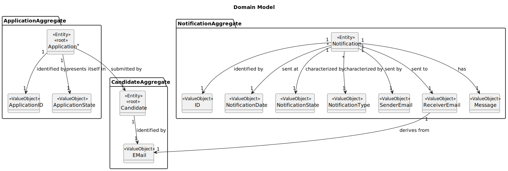
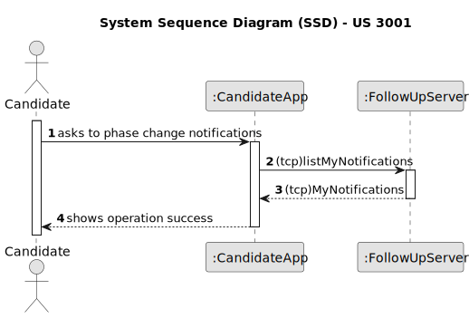
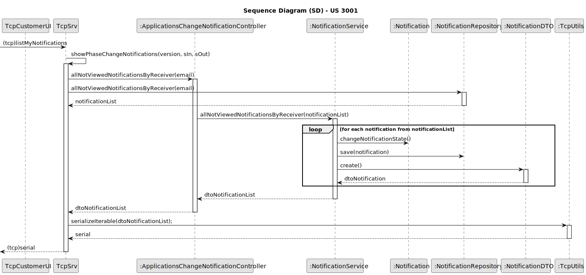

# US 3001

## 1. Context

*This task is being taken for the first time in Sprint C.*

## 2. Requirements

**US 3001** As Candidate, I want to be notified in my application when the state of one of my applications changes

**Client Acceptance Criteria:**

* Q174 Artur – US3001 - Na US 3001 pretende que o candidato seja notificado na sua aplicação quando o estado de uma
  aplicação mudar. De que forma pretende que o candidato seja notificado? E caso o candidato não esteja a correr a
  aplicação, essa notificação é perdida?

* A174 O candidato deve ser notificado quando a sua “app” está em execução. Relativamente a notificações que “acontecem”
  quando não está a correr a aplicação, seria interessante que as recebesse da próxima vez que executasse a aplicação

* Q175 Isabel – US3001 - Questão âmbito notificações - O candidato será notificado, quando a sua candidatura mudar de
  estado. O que se entende por notificado, é receber um email, quando entra na aplicação tem uma fila de 'inbox' ?
  Quando a aplicação está ligada recebo email? É o candidato que faz o pedido(cliente) (Pop) inicia assim a comunicação,
  e recebe a resposta/notificação (servidor). E como encaixo o cenário de notificação(push)?

* A175 Ver Q174. Neste caso as notificações são na aplicação do candidato, não são por email.

* Q189 Varela – US3001 – Application State – I'd like some clarifications regarding the state that US3001 mentions. Is
  it the "accepted/not accepted" state, or a state regarding the phases of the recruitment process of which the
  application is associated to?

* A189. This US is focused on the Candidate perspective. He/she may not be aware of the internal phases of the
  recruitment process. But he/she is interested in knowing the “external” state of his/her applications. For instance,
  as a candidate I would like to know if my application was received. Then I would like to know if my application was
  accepted or not and, finally, if I was selected or not

* Q229 Jose Afonso – US 3001 - Segundo a nossa perspetiva sobre esta funcionalidade, achámos melhor o utilizador ter na
  sua aplicação uma espécie de inbox de notificações. Quando o utilizador está na funcionalidade das notificações este
  recebe as notificações que tinha e que não foram enviadas porque não estava na aplicação e depois fica á espera de
  novas notificações que apareçam entretanto, até o utilizador pedir para sair da funcionalidade. Esta abordagem está
  alinhada com suas expectativas?

* A229. Pode ser. Mas não seria possível receber as notificação mesmo não estando nessa “opção de menu”? Sendo uma
  aplicação “console” limita um pouco a UI, mas não seria possível receber as notificações desde que tenha a aplicação
  em execução mas só mostrar essas notificações quando o utilizador seleciona a opção? Em termos de UI a diferença é
  mínima, em termos de implementação pode ser significativa. Talvez esta seja até mais uma questão para RCOMP.

* Q233 Jose Afonso – US 3001 – Notifications - Em questões anteriores sobre esta funcionalidade menciona que como
  candidate gostaria de saber se a sua candidatura foi recebida, aceite e escolhida. Pedimos que descreva a que se
  refere quando diz que uma candidatura foi aceite, e quando foi escolhida.

* A233. É aceite se passa o processo de verificação de requisitos. É escolhida se após o ranking está dentro dos lugares
  das vagas para o job opening.

**NON FUNCTIONAL REQUIREMENTS:**

NFR10(RCOMP) Functionalities related to the Candidate and Candidate Apps and to the Follow Up Server part of the system
have very specific technical requirements. It must follow a client-server architecture, where a client application is
used to access a server. Communications between these two components must follow specific protocol described in a
document from RCOMP ("Application Protocol"). Also, the client applications can not access the relational database, they
can only access the server application.

NFR11(RCOMP) The solution should be deployed using several network nodes. It is
expected that, at least, the relational database server and the Follow Up Server be deployed in nodes diferent from
localhost, preferably in the cloud. The e-mail notifcation
tasks must be executed in background by the Follow Up Server.

## 3. Analysis

## 4. Design

For the implementation of this US Candidate App must communicate with the Server for it to give the Notification of
when a application state change occurs in the Candidate application.
The Candidate will select the option to list his Notifications and a code with the number 6 (CODE DEFINED FOR THIS RCOMP
US), alongside its username will be passed to the Server.
The Server will then search for all not viewed notifications of the put them in DTO format. Then it serializes a list of
DTO and sends it to the client. Finally all the necessary information that should be presented will be passed to the
Candidate App that will deserialize the information and then print it to the screen.

### 4.1. Sequence Diagram

