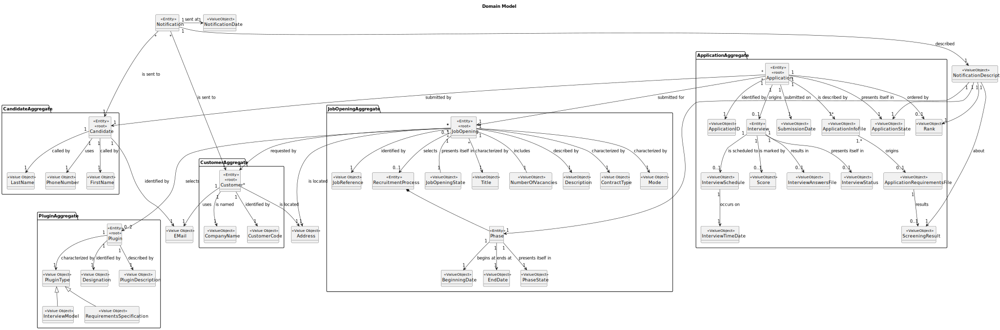

## 1.Domain Model Sprint A

## 2.Domain Model Sprint B

## 3.New Domain Model (Sprint C)

## 4.Changes made to the Domain Model (Sprint B)
- Cardinality: Interview to InterviewSchedule.
- InterviewStatus created, so it would be known if the interview was realized or not.
- Interview to Entity (was ValueObject).
- Added Notification, NotificationDescription and connection with the respective notified and what is the notification about.
- Added NotificationDate to know when the notification was sent.
- Added the ScreeningResult so the candidates can be notified about it.
- Added ApplicationInfoFile that includes the Curriculum Vitae, so it was removed.
- Added ApplicationRequirementsFile, obtained from the ApplicationInfoFile.
- Every attribute was changed to a Value Object.
- JobOpeningState added to identify if it is completed or not.
- Period associated with Phase was removed, was not necessary.
- Added PluginDescription.
- Cardinality: JobOpening to RequirementsSpecification -> JobOpening only has a RequirementsSpecification when US 2009 occurs.
- Added PluginType.
- Recruitment Process and Phase to Entity
- Full Name converted to FirstName and LastName

## 5.Changes made to the Domain Model (Sprint C)
- Added PhaseName to identify the phase of the recruitment process.
- Added Class Aggregate for Rank purposes
- Class Order and Rank added

