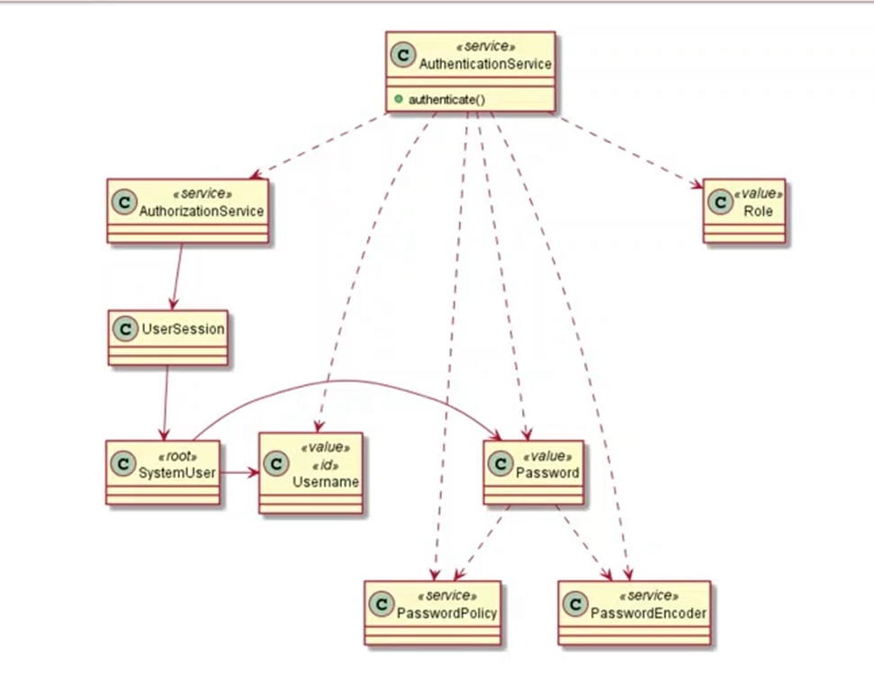
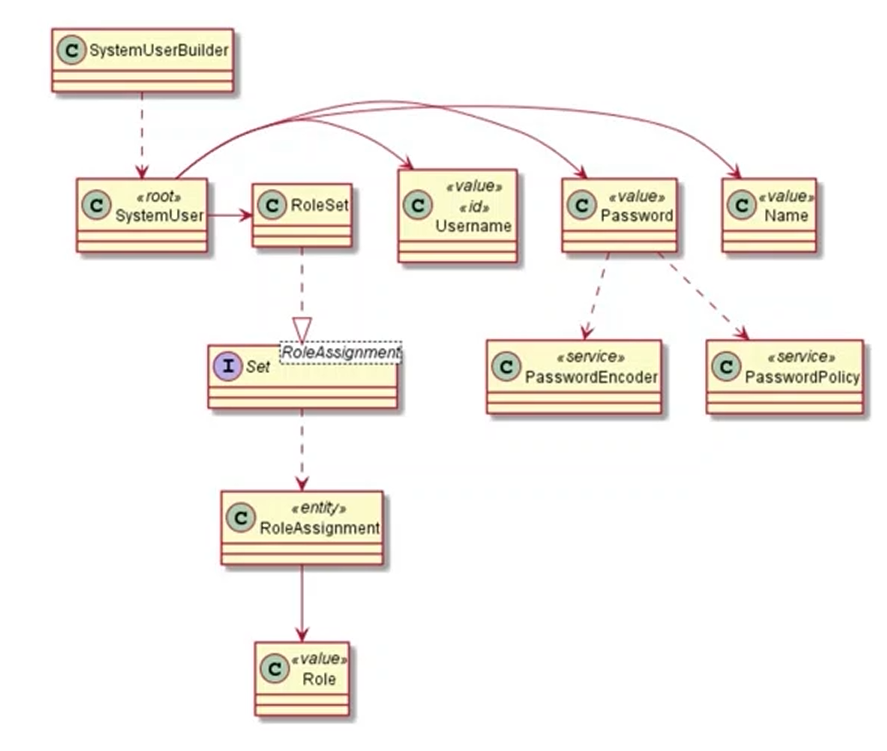

# US g007

## 1. Context

*This task is being taken for the first time in Sprint B.*

## 2. Requirements

**US G007** As a Project Manager, I want the system to support and apply authentication and
authorization for all its users and functionalities.

**Client Acceptance Criteria:**

* Q59: Pretende-se que todos os utilizadores acedam à mesma aplicação e que consoante as credências tenham acesso a
  funcionalidades diferentes ou são aplicações diferentes (que acedem à mesma base de dados)?

* A59: Do ponto de vista do product owner faz sentido ter aplicações distintas. Ou seja, quando, por exemplo, um
  utilizador “executa” a aplicação “Candidate App” mesmo que se identifique como um user válido do tipo “Customer” a
  aplicação não deve aceitar esse login.

## 3. Analysis and Design

*For this user story, the EAPLI base project was user, more precisely, the "Infrastructure Authz" which is responsible
for the authentication and authorization of user in these system.In this module, relevant concepts to the user are present
such as Username, Password, among others.*

### 3.1. Realization

*Having this said, certain changes in classes outside of this module were made, these being the change of existent roles
to the ones relevant to the project such like: "CUSTOMER_MANAGER", "LANGUAGE_ENGINEER" or "CANDIDATE". Apart from this
all methods related to the creation of users were changed in a way that would make the userName of these be their email,
as requested from the Client.*

### 3.2. Class Diagram

## 4. Observations

*Most of the classes responsible for this User Story are form the base project available in the EAPLI moodle*
